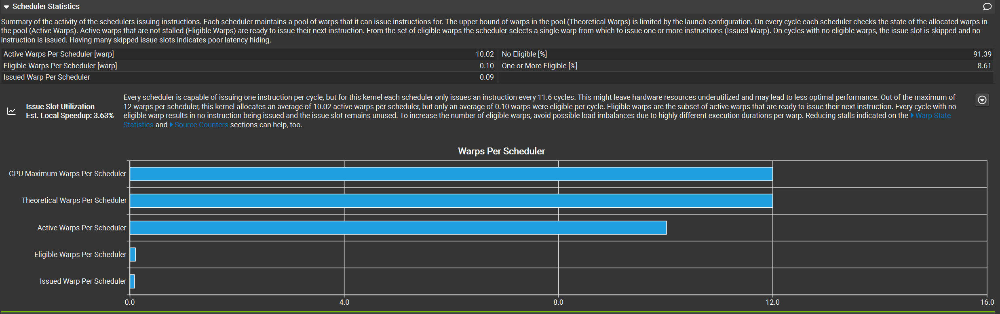
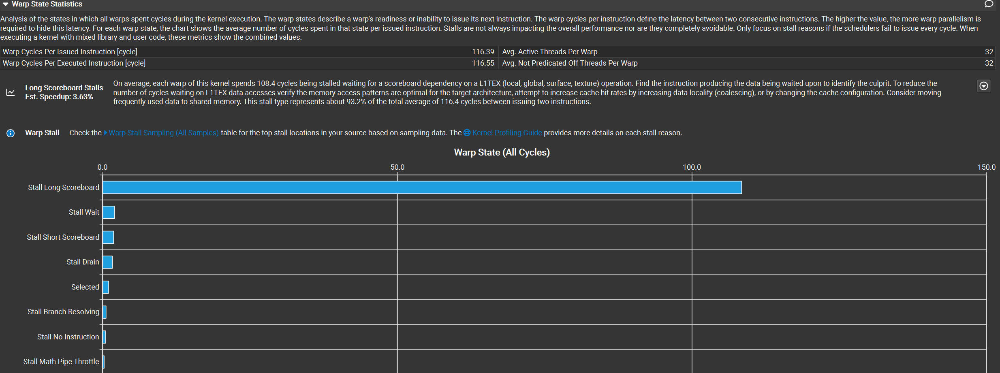
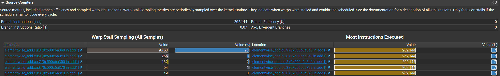

# CUDA 学习笔记

本文从 CUDA 编程模型出发，建立代码中的 `grid / block / thread` 与 GPU 硬件中的 `SM / warp scheduler / execution unit` 之间的联系，再讨论内存层次、合并访问和 bank conflict。

## 1. CUDA 异构编程模型

### 1.1 Host 与 Device

- **Host**：CPU 及其内存，负责程序控制、内存分配、数据传输和 kernel launch。
- **Device**：GPU 及其显存，负责执行大规模并行 kernel。
- **Kernel**：由 host 发起、在 device 上由大量 CUDA thread 并行执行的函数，使用 `__global__` 声明。

```cpp
__global__ void vector_add(const float *a, const float *b, float *c, int n) {
    int i = blockIdx.x * blockDim.x + threadIdx.x;
    if (i < n) {
        c[i] = a[i] + b[i];
    }
}

int threads = 256;
int blocks = (n + threads - 1) / threads;
vector_add<<<blocks, threads>>>(a, b, c, n);
```

`<<<blocks, threads>>>` 描述的是逻辑工作划分，不是直接指定使用多少个 SM 或 CUDA core。kernel launch 对 host 通常是异步的；同一 stream 中的操作按提交顺序执行。

### 1.2 Grid、Block 与 Thread

```text
Kernel launch
└── Grid
    ├── Thread Block 0
    │   ├── Thread 0
    │   ├── Thread 1
    │   └── ...
    ├── Thread Block 1
    └── ...
```

- 一次普通 kernel launch 产生一个 **grid**。
- grid 由多个 **thread block** 组成。
- block 由多个 **thread** 组成，普通 CUDA block 最多包含多少线程由设备属性决定，常见上限为 1024。
- grid 和 block 都可以是一维、二维或三维，维度主要用于自然表达向量、矩阵和体数据。
- 不同 block 必须能够独立执行；硬件可以按任意顺序调度它们。

常用内建变量：

| 变量 | 含义 |
|---|---|
| `threadIdx.{x,y,z}` | 线程在 block 内的坐标 |
| `blockIdx.{x,y,z}` | block 在 grid 内的坐标 |
| `blockDim.{x,y,z}` | 每个 block 的尺寸 |
| `gridDim.{x,y,z}` | grid 的 block 数量 |

一维全局线程编号：

```cpp
int global_id = blockIdx.x * blockDim.x + threadIdx.x;
```

二维行主序数据常用：

```cpp
int col = blockIdx.x * blockDim.x + threadIdx.x;
int row = blockIdx.y * blockDim.y + threadIdx.y;
int index = row * width + col;
```

## 2. GPU 实际执行模型

### 2.1 SM（Streaming Multiprocessor）

SM 是 GPU 调度和执行 thread block 的核心硬件单元。一个 GPU 包含多个 SM，每个 SM 通常包含：

- warp scheduler 和 instruction dispatcher；
- FP32、INT、FP64、Tensor Core 等执行管线；
- load/store unit、special function unit；
- 大量寄存器；
- shared memory 和 L1 cache；
- warp、block 的驻留与同步状态。

一个 block 被调度到某个 SM 后，其生命周期内通常一直驻留在该 SM，不会拆到多个 SM 上执行。一个 SM 可以同时驻留多个 block，具体数量取决于线程数、warp 数、寄存器、shared memory 和架构上限。

### 2.2 Warp：真正的调度执行组

block 中的 thread 会按线性线程编号被分成若干个 **warp**，每个 warp 固定包含 32 个 lane：

```text
warp_id_in_block = linear_thread_id / 32
lane_id          = linear_thread_id % 32
```

三维 block 的线性线程编号中，`threadIdx.x` 变化最快：

```text
linear_thread_id = threadIdx.x
                 + blockDim.x × (threadIdx.y + blockDim.y × threadIdx.z)
```

例如一个包含 256 个 thread 的 block 会被划分为 8 个 warp。若 block 有 100 个 thread，则会形成 4 个 warp，最后一个 warp 只有 4 个有效 lane，其余 lane 不做有效工作。

### 2.3 SIMT 与分支分歧

CUDA 采用 **SIMT（Single Instruction, Multiple Threads）** 模型：程序员编写独立 thread，硬件以 warp 为单位调度指令。

当一个 warp 中的 lane 走向不同分支时，会发生 **warp divergence**：

```cpp
if (threadIdx.x % 2 == 0) {
    path_a();
} else {
    path_b();
}
```

硬件需要在不同活动掩码下执行各条路径，不属于当前路径的 lane 暂时不活跃，因此吞吐量可能下降。Volta 及更新架构支持 Independent Thread Scheduling，但 warp 仍是主要的指令调度与资源管理单位；不能据此忽略分歧或 warp 级同步。

### 2.4 CUDA Core 不等于 CUDA Thread

- CUDA thread 是软件中的逻辑执行实例。
- CUDA core 通常指 SM 内执行某类标量算术指令的硬件运算单元。
- thread 不会永久绑定到某个 CUDA core。
- warp scheduler 在大量就绪 warp 中选择 warp，把指令发射到对应执行管线。
- 一条 warp 指令需要几个周期完成，取决于架构、指令类型、执行单元数量和吞吐率，不能简单认为“32 个 thread 必然对应 32 个 CUDA core 并在一个周期完成”。

## 3. 编程模型与硬件模型的对应关系

| CUDA 编程概念 | 硬件上的实际含义 | 关键约束 |
|---|---|---|
| Host thread | CPU 上提交 CUDA 工作的线程 | launch 通常对 host 异步 |
| Kernel | GPU 上执行的一段程序 | 编译为 GPU 指令，由大量 warp 执行 |
| Grid | 一次 kernel 的全部 block | 通常远大于 GPU 同时可驻留的容量，分批执行 |
| Thread block | SM 的调度和资源分配单位 | 一个 block 只驻留一个 SM；多个 block 可驻留同一 SM |
| Thread | 独立的逻辑执行实例 | 拥有自己的索引、寄存器状态和局部变量 |
| Warp | 32 个连续线性 thread 组成的硬件调度组 | 合并访问、分支分歧和部分同步都以 warp 为重要单位 |
| SM | 执行 block/warp 的硬件处理器 | 数量由具体 GPU 决定，不能由 launch 配置直接指定 |
| CUDA core | SM 内的算术执行单元 | 不与 thread 一一绑定，也不等同于 CPU core |
| Shared memory | SM 上由同一 block 共享的片上存储 | block 结束后内容失效，容量会限制驻留 block 数 |
| Register | SM 寄存器文件中分配给 thread 的状态 | 每线程用量过大时降低 occupancy，严重时可能 spill |

### 3.1 Block 如何被调度到 SM

假设某 GPU 有 10 个 SM，kernel 启动配置为：

```cpp
kernel<<<80, 256>>>();
```

- grid 有 80 个 block；每个 block 有 256 个 thread，即 8 个 warp。
- 80 个 block 不会因为只有 10 个 SM 就减少为 10 个。
- GPU 先让每个 SM 驻留若干个 block；block 完成后，再调度尚未执行的 block，形成多个 wave。
- 实际同时驻留多少 block，必须结合 kernel 资源用量和目标 GPU 的每 SM 上限计算。

```text
80 logical blocks
        │  hardware scheduler distributes work dynamically
        ▼
10 SMs × several resident blocks per SM × multiple execution waves
```

因此，`gridDim` 描述问题规模，SM 数量描述硬件并行容量，两者不是一一对应关系。

### 3.2 占用率（Occupancy）与资源限制

#### 3.2.1 占用率的定义

**占用率（Occupancy）**是一个流式多处理器（Streaming Multiprocessor）上实际驻留的活跃线程束（Active Warp）数量，与该流式多处理器允许驻留的最大线程束数量之比：

```text
占用率（Occupancy） =
    每个流式多处理器的活跃线程束数（Active Warps Per Multiprocessor）
    ÷ 每个流式多处理器的最大线程束数（Maximum Warps Per Multiprocessor）
```

这里的“活跃”表示线程束的执行上下文和资源已经驻留在流式多处理器上，不代表它此刻正在执行指令。驻留线程束可能处于就绪、执行、等待内存、等待数据依赖或等待同步等状态。

当某个线程束停顿时，线程束调度器（Warp Scheduler）可以发射其他就绪线程束的指令。因此，足够多的驻留线程束有助于隐藏延迟，但：

> 占用率不是计算单元利用率，也不是性能百分比。百分之百的占用率不保证性能最好；较低占用率也可能通过数据复用、指令级并行（Instruction-Level Parallelism）或更高的访存效率获得更好性能。


- 每个线程块的线程数（Threads Per Block）；
- 每个线程使用的寄存器数（Registers Per Thread）；
- 每个线程块使用的共享内存（Shared Memory Per Block）。

三项输入分别受到右侧线程与线程束、寄存器、共享内存物理上限的约束，最终共同决定每个流式多处理器可以驻留多少个线程块。

#### 3.2.2 每个线程块的线程数（Threads Per Block）如何影响实际线程束

设：

```text
每个线程块的线程数（Threads Per Block）
每个线程束的线程数（Threads Per Warp）
每个流式多处理器的线程上限（Maximum Threads Per Multiprocessor）
每个流式多处理器的线程束上限（Maximum Warps Per Multiprocessor）
每个流式多处理器的线程块上限（Maximum Thread Blocks Per Multiprocessor）
单个线程块的线程上限（Maximum Threads Per Block）
```

首先，每个线程块的线程数必须满足单个线程块的硬件上限：

```text
每个线程块的线程数（Threads Per Block）
    ≤ 单个线程块的线程上限（Maximum Threads Per Block）
```

然后，将线程块中的线程划分为线程束：

```text
每个线程块的线程束数（Warps Per Block） =
    向上取整（Ceiling）(
        每个线程块的线程数（Threads Per Block）
        ÷ 每个线程束的线程数（Threads Per Warp）
    )
```

如果线程数不是每个线程束线程数的整数倍，最后一个线程束仍会占用一个完整的线程束槽位，但只有部分线程通道（Lane）执行有效工作。因此，每个线程块的线程数通常选择 32 的整数倍。

线程数量和线程束数量分别给出可驻留线程块数的上限：

```text
线程数量允许的驻留线程块数（Blocks Limited by Threads） =
    向下取整（Floor）(
        每个流式多处理器的线程上限（Maximum Threads Per Multiprocessor）
        ÷ 每个线程块的线程数（Threads Per Block）
    )

线程束数量允许的驻留线程块数（Blocks Limited by Warps） =
    向下取整（Floor）(
        每个流式多处理器的线程束上限（Maximum Warps Per Multiprocessor）
        ÷ 每个线程块实际分配的线程束数（Allocated Warps Per Block）
    )
```

每个线程块实际分配的线程束数（Allocated Warps Per Block）至少等于向上取整后的线程束数。某些架构还会根据线程束分配粒度（Warp Allocation Granularity）进行资源取整，最终结果应以目标架构的占用率计算器或 CUDA 占用率应用程序接口（CUDA Occupancy Application Programming Interface）为准。

只考虑线程、线程束和线程块硬件上限时：

```text
线程资源允许的驻留线程块数（Blocks Limited by Thread Resources）
    = 取最小值（Minimum）(
    线程数量允许的驻留线程块数（Blocks Limited by Threads）,
    线程束数量允许的驻留线程块数（Blocks Limited by Warps）,
    每个流式多处理器的线程块上限（Maximum Thread Blocks Per Multiprocessor）
)
```

每个线程块的线程数并不直接等于最终的活跃线程束数。必须先结合全部资源得到最终驻留线程块数，再计算：

```text
每个流式多处理器的活跃线程束数（Active Warps Per Multiprocessor） =
    每个流式多处理器的驻留线程块数（Resident Blocks Per Multiprocessor）
    × 每个线程块的线程束数（Warps Per Block）
```

因此，增加每个线程块的线程数会增加每个线程块的线程束数，但也可能减少同时驻留的线程块数，两者共同决定最终活跃线程束数量。

#### 3.2.3 每个线程使用的寄存器数（Registers Per Thread）如何影响实际线程束

设：

```text
每个线程的寄存器数（Registers Per Thread）
每个流式多处理器的寄存器总数（Registers Per Multiprocessor）
单个线程的寄存器上限（Maximum Registers Per Thread）
单个线程块的寄存器上限（Maximum Registers Per Thread Block）
寄存器分配单元大小（Register Allocation Unit Size）
```

首先必须满足单个线程的寄存器上限：

```text
每个线程的寄存器数（Registers Per Thread）
    ≤ 单个线程的寄存器上限（Maximum Registers Per Thread）
```

一个线程块的原始寄存器需求近似为：

```text
每个线程块的原始寄存器需求（Raw Registers Per Block） =
    每个线程的寄存器数（Registers Per Thread）
    × 每个线程块的线程数（Threads Per Block）
```

但寄存器并不是严格按照这个乘积逐个分配。硬件通常按照线程束和寄存器分配单元大小（Register Allocation Unit Size）进行向上取整，具体方式还取决于寄存器分配粒度（Register Allocation Granularity）：

```text
每个线程块实际分配的寄存器数（Allocated Registers Per Block） =
    按照寄存器分配粒度（Register Allocation Granularity）
    向上取整（Ceiling）(
        每个线程块的原始寄存器需求（Raw Registers Per Block）
    )
```

取整后的寄存器需求必须满足单个线程块的寄存器上限：

```text
每个线程块实际分配的寄存器数（Allocated Registers Per Block）
    ≤ 单个线程块的寄存器上限（Maximum Registers Per Thread Block）
```

寄存器资源允许的驻留线程块数近似为：

```text
寄存器数量允许的驻留线程块数（Blocks Limited by Registers） =
    向下取整（Floor）(
        每个流式多处理器的寄存器总数（Registers Per Multiprocessor）
        ÷ 每个线程块实际分配的寄存器数（Allocated Registers Per Block）
    )
```

因此，每个线程使用的寄存器数与每个线程块的线程数是乘法关系。二者任意一个增加，单个线程块所需的寄存器都可能增加，进而减少驻留线程块和活跃线程束的数量。

可以通过编译报告查看内核函数实际使用的寄存器数：

```text
nvcc --ptxas-options=-v ...
```

限制寄存器数量可能提高占用率，但也可能造成寄存器溢出（Register Spill）。溢出的数据通常进入局部内存（Local Memory），并经过缓存与设备内存，因此不能为了提高占用率而盲目压低寄存器数。

#### 3.2.4 每个线程块的共享内存（Shared Memory Per Block）如何影响实际线程束

设：

```text
用户共享内存（User Shared Memory）
运行时共享内存开销（Runtime Shared Memory）
每个流式多处理器的共享内存总量（Shared Memory Per Multiprocessor）
单个线程块的共享内存上限（Maximum Shared Memory Per Block）
共享内存分配单元大小（Shared Memory Allocation Unit Size）
```

每个线程块的原始共享内存需求为：

```text
每个线程块的原始共享内存需求（Raw Shared Memory Per Block） =
    用户共享内存（User Shared Memory）
    + 运行时共享内存开销（Runtime Shared Memory）
```

用户共享内存包括静态共享内存和动态共享内存（Dynamic Shared Memory）。动态共享内存通过内核函数启动配置的第三个参数指定：

```cpp
extern __shared__ float buffer[];
kernel<<<grid_size, block_size, dynamic_shared_memory_bytes>>>(...);
```

真实分配量需要按照共享内存分配单元大小（Shared Memory Allocation Unit Size）向上取整：

```text
每个线程块实际分配的共享内存（Allocated Shared Memory Per Block） =
    向上取整（Ceiling）(
        每个线程块的原始共享内存需求（Raw Shared Memory Per Block）
        ÷ 共享内存分配单元大小（Shared Memory Allocation Unit Size）
    ) × 共享内存分配单元大小（Shared Memory Allocation Unit Size）
```

取整后的分配量必须满足单个线程块的共享内存上限：

```text
每个线程块实际分配的共享内存（Allocated Shared Memory Per Block）
    ≤ 单个线程块的共享内存上限（Maximum Shared Memory Per Block）
```

共享内存允许的驻留线程块数为：

```text
共享内存容量允许的驻留线程块数（Blocks Limited by Shared Memory） =
    向下取整（Floor）(
        每个流式多处理器的共享内存总量（Shared Memory Per Multiprocessor）
        ÷ 每个线程块实际分配的共享内存（Allocated Shared Memory Per Block）
    )
```

共享内存按照线程块分配，因此它先限制每个流式多处理器的驻留线程块数，再间接限制活跃线程束数。只有当共享内存是最严格的限制因素时，才可以写成：

```text
每个流式多处理器的活跃线程束数（Active Warps Per Multiprocessor） =
    共享内存容量允许的驻留线程块数（Blocks Limited by Shared Memory）
    × 每个线程块的线程束数（Warps Per Block）
```

共享内存限制通常具有台阶效应：只减少少量字节，如果没有跨过“能够多容纳一个线程块”的分配边界，占用率可能不变；一旦跨过边界，驻留线程块数可能增加一个。

#### 3.2.5 三类资源共同决定最终占用率

对于同一个启动配置，需要分别计算所有资源允许的驻留线程块数：

```text
每个流式多处理器的驻留线程块数（Resident Blocks Per Multiprocessor）
    = 取最小值（Minimum）(
    每个流式多处理器的线程块硬件上限（Maximum Thread Blocks Per Multiprocessor）,
    线程数量允许的驻留线程块数（Blocks Limited by Threads）,
    线程束数量允许的驻留线程块数（Blocks Limited by Warps）,
    寄存器数量允许的驻留线程块数（Blocks Limited by Registers）,
    共享内存容量允许的驻留线程块数（Blocks Limited by Shared Memory）
)
```

得到驻留线程块数后，再计算最终结果：

```text
每个流式多处理器的活跃线程数（Active Threads Per Multiprocessor） =
    驻留线程块数（Resident Blocks Per Multiprocessor）
    × 每个线程块的线程数（Threads Per Block）

每个流式多处理器的活跃线程束数（Active Warps Per Multiprocessor） =
    驻留线程块数（Resident Blocks Per Multiprocessor）
    × 每个线程块的线程束数（Warps Per Block）

占用率（Occupancy） =
    活跃线程束数（Active Warps Per Multiprocessor）
    ÷ 每个流式多处理器的最大线程束数（Maximum Warps Per Multiprocessor）
```

图片中各区域的对应关系如下：

| 上方输入 | 右侧需要对照的完整英文限制项 | 首先得到的限制 | 最终影响 |
|---|---|---|---|
| 每个线程块的线程数（Threads Per Block） | Threads Per Warp、Maximum Warps Per Multiprocessor、Maximum Threads Per Multiprocessor、Maximum Thread Block Size、Maximum Thread Blocks Per Multiprocessor | 线程和线程束允许的驻留线程块数 | 驻留线程块数与活跃线程束数 |
| 每个线程的寄存器数（Registers Per Thread） | Registers Per Multiprocessor、Maximum Registers Per Thread Block、Maximum Registers Per Thread、Register Allocation Unit Size、Register Allocation Granularity | 寄存器允许的驻留线程块数 | 驻留线程块数与活跃线程束数 |
| 每个线程块的共享内存（Shared Memory Per Block） | Shared Memory Per Multiprocessor、Maximum Shared Memory Per Block、Shared Memory Allocation Unit Size、Shared Memory Per Block for CUDA Runtime Use | 共享内存允许的驻留线程块数 | 驻留线程块数与活跃线程束数 |

完整分析顺序为：

1. 由每个线程块的线程数计算每个线程块的线程束数。
2. 分别计算线程与线程束、寄存器、共享内存和硬件线程块上限允许的驻留线程块数。
3. 取所有驻留线程块上限中的最小值。
4. 用最终驻留线程块数计算活跃线程数、活跃线程束数和占用率。
5. 使用 Nsight Compute 或 CUDA 占用率应用程序接口验证限制因素，再用内核函数实际执行时间评价配置。

```text
每个线程块的线程数 → 每个线程块的线程束数 ──────┐
每个线程的寄存器数 × 每个线程块的线程数 ───────┼→ 驻留线程块数
每个线程块的共享内存 ─────────────────────────┤
流式多处理器的架构上限 ───────────────────────┘
                                                    ↓
                                        活跃线程束数 → 占用率
```

优化时应考虑资源之间的权衡：

- 减少每个线程块的线程数可能增加驻留线程块数，但每个线程块的线程束数也会减少；
- 减少每个线程的寄存器数可能增加驻留线程束，却可能造成寄存器溢出；
- 减少每个线程块的共享内存可能提高占用率，却可能降低数据复用并增加全局内存（Global Memory）流量；
- 最佳配置应综合占用率、数据复用、访存效率、指令级并行和实际执行时间。


### 3.3 Warp Scheduler：多个 Warp 如何发射

一个 block 驻留到 SM 后会被切分为若干个 warp。每个 warp 都有独立的程序计数器（Program Counter，PC）、寄存器状态、活动掩码（Active Mask）和依赖状态；但它们不会同时都在执行。SM 中的一个或多个 warp scheduler 会在每个时钟周期从自己管理的 warp 池中选择可发射的 warp，并通过 instruction dispatcher 将其下一条指令送往相应执行管线。

```text
block 驻留到 SM
    ↓
多个 resident warp（已分配寄存器、shared memory 和执行上下文）
    ↓  检查依赖、访存返回、同步与管线资源
eligible warp（下一条指令可发射）
    ↓  scheduler 选择
issued warp（本周期实际发射一条 warp 指令）
    ↓
FP32 / INT / LDST / SFU / Tensor Core 等执行管线
```

现代 NVIDIA GPU 通常把一个 SM 划分为多个处理分区；每个分区配有 warp scheduler 和 dispatch 单元。具体数量和可双发射的能力随架构变化，但应把它理解为：**每个 scheduler 每周期从其 warp 池中挑选 ready warp 发射，而不是让一个 warp 独占 SM 直到结束。**

硬件的确切选择策略没有作为 CUDA API 公开。CUDA 程序不能指定某个 warp 的发射顺序；`__syncwarp()` 只提供同步语义，也不指定调度顺序。编译器负责同一 warp 内的指令次序和软件流水，硬件 scheduler 在运行时负责在多个 warp 间交错发射。

#### 3.3.1 Active、Eligible 与 Issued 的区别

| 名称 | 含义 | 能否在本周期发射 |
|---|---|---|
| Resident / Active warp | warp 已驻留在 SM，尚未整体退出；它占用寄存器等资源 | 不一定 |
| Eligible warp | 下一条指令的操作数已就绪，未被同步或资源条件阻塞 | 可以参与选择 |
| Issued warp | scheduler 在该周期实际选中并发射了指令的 warp | 已发射 |
| Stalled warp | warp 仍 active，但下一条指令暂时不能发射 | 不可以 |

因此必须区分：

```text
Active ≠ Eligible
Eligible ≠ Issued
```

例如，warp 发出 global load 后仍是 active warp；若其下一条 `add` 依赖该 load 的结果，则它在数据返回前不是 eligible warp。scheduler 会转而发射其他 eligible warp 的指令，以隐藏这段延迟。

分支分歧还会引入另一层含义：warp 只要还有至少一个 lane 未退出，就是 active warp；但当前指令的 active mask 可能只启用其中一部分 lane。不要把“active warp 数”与“当前活跃 lane 数”混为一谈。

#### 3.3.2 常见不可发射原因

| 状态或 stall 原因 | 含义 | 常见线索 |
|---|---|---|
| Long Scoreboard | 等待较长延迟的访存结果，常见于 global/local/surface/texture 路径 | L2 miss、DRAM 延迟、缺少并行或数据复用 |
| Short Scoreboard | 等待较短延迟的依赖结果 | 寄存器 RAW 依赖、较近的流水线结果 |
| Wait | 等待固定流水线延迟或指定等待周期 | 指令依赖与编译器调度不足 |
| Barrier | 等待 `__syncthreads()`、`__syncwarp()` 或相关同步条件 | block 内 warp 到达不同步 |
| LG / MIO Throttle | global/local 或内存 I/O 管线、队列拥塞 | 访存请求过多，和“数据尚未返回”不同 |
| Math Pipe Throttle | 数学执行管线已满 | 计算管线吞吐成为瓶颈 |
| Not Selected | warp 已 eligible，但本周期选择了其他 eligible warp | 通常说明 ready warp 足够多，不必单独视为问题 |

不同 GPU 架构和 Nsight Compute 版本展示的 stall 名称会略有差异。stall 本身也不必然是问题；只有 scheduler 经常没有 eligible warp、发射槽闲置时，才说明这些 stall 正在限制性能。

#### 3.3.3 使用 Nsight Compute 阅读 Scheduler Statistics



建议按下面顺序阅读这张图：

1. **GPU Maximum Warps Per Scheduler**：硬件上限。图中为 12。
2. **Theoretical Warps Per Scheduler**：由 block 大小、寄存器、shared memory、每 SM 最大 block 数等资源限制推导出的上限。它低于 GPU Maximum 时，先查 occupancy 限制，而不是查运行时 stall。
3. **Active Warps Per Scheduler**：运行期间平均实际驻留且未退出的 warp 数。它明显低于 Theoretical 时，检查 grid 是否太小、kernel 启动/收尾的 tail effect、warp 提前退出以及 block 在 SM 子分区间的分配粒度。
4. **Eligible Warps Per Scheduler**：平均每周期可立即发射的 warp 数。这是延迟隐藏是否足够的核心指标。
5. **Issued Warp Per Scheduler** 与 **No Eligible**：前者接近每周期实际发射次数；后者表示没有任何 ready warp 的周期比例。No Eligible 高说明 issue slot 经常空闲。

图中的实例为：GPU Maximum = 12、Theoretical = 12、Active = 10.02、Eligible = 0.10、Issued = 0.09，且 No Eligible = 91.39%。这表示该 kernel 的理论 occupancy 已达到硬件上限，问题不是“再提高 resident warp 上限”，而是多数驻留 warp 同时不可发射。应继续查看 Warp State Statistics 和 Source Counters，找出它们在等待什么。

对于 `elementwise_add.cu` 中的简单向量加法，还要注意 block 配置：`block(64)` 每 block 只有 2 个 warp。若 GPU 每 SM 的最大 resident block 数先成为限制，即使硬件支持更多 warp，Theoretical Warps Per Scheduler 也会低于 GPU Maximum。`block=128`、`256` 等配置应通过实测比较，而不是只凭 occupancy 选择。

#### 3.3.4 使用 Warp State Statistics 定位等待类型



这张图把每个 warp 在两次指令发射之间所经历的周期归类。横轴通常是 **每条已发射指令对应的平均 warp cycle 数**，不是简单百分比；某一类条形越长，说明 warp 在这一状态花费的平均周期越多。

阅读步骤：

1. 先看 `Warp Cycles Per Issued Instruction`。数值大说明两个相邻发射之间等待时间长。
2. 只在 Scheduler Statistics 中 `No Eligible` 很高时，才把这些 stall 当作主要优化对象。
3. 找最长的 stall 类型，按上一节表格确定是数据依赖、访存延迟、同步还是管线拥塞。
4. 再去 Source Counters 找对应的源代码/SASS 位置。

图中的 `Warp Cycles Per Issued Instruction = 116.39`，其中 `Long Scoreboard Stalls = 108.4` cycle，约占 93.2%。含义是：warp 的下一条指令在等待 L1TEX（local/global/surface/texture）路径上某次访存的结果写回寄存器。对于：

```cpp
z[n] = x[n] + y[n];
```

warp 发出 `x[n]`、`y[n]` 的加载后，`add` 依赖加载结果；在数据返回前，scoreboard 会阻止依赖指令发射。它不是“带宽已经打满”的直接证据；若是请求队列或访存管线拥塞，更常见的是 `LG Throttle` 或 `MIO Throttle`。

图中 `Avg. Active Threads Per Warp = 32` 和 `Avg. Not Predicated Off Threads Per Warp = 32`，说明该例中 warp lane 利用率完整，没有明显的尾 warp 浪费或 predication 掩码损失。因此诊断重点应放在访存延迟与可并行工作量上，而不是分支分歧。

#### 3.3.5 使用 Source Counters 回到源码



Source Counters 将采样到的 warp stall 和动态执行指令映射回源码行或 SASS 地址。推荐的读法是：

1. 在 `Warp Stall Sampling (All Samples)` 表中按 Value(%) 找最高条目，定位最常出现 stall 的源码位置。
2. 点击该行查看对应 SASS，并向前寻找产生依赖结果的 load、math 或同步指令。
3. 用 `Most Instructions Executed` 判断该位置是否也是动态执行热点；热点且 stall 高时优先优化。
4. 结合访问模式、缓存命中率和内存事务指标验证推测，而不是仅凭一条 stall 名称改代码。

图中的最高采样位置是 `elementwise_add.cu:8`，占约 93%。该行正是 `add1` 的 `z[n] = x[n] + y[n]`；源代码的一行会被编译为多条 SASS，所以采样 PC 往往指向等待结果的**消费者**，而不一定精确指向发起 load 的那条机器指令。应在对应 SASS 中确认依赖链。

这个例子的完整诊断链为：

```text
Scheduler Statistics：91.39% 周期没有 eligible warp
        ↓
Warp State Statistics：主要是 Long Scoreboard
        ↓
Source Counters：stall 集中在向量加法对应的源码行
        ↓
结论：warp 等待 global-memory 数据；增加可用并行度/指令级并行，
      改善合并访问和数据复用，并以实际带宽与运行时间验证效果。
```

对于纯 elementwise add，这通常是内存带宽型工作负载。即使 Long Scoreboard 比例高，也应最终检查达到的读写带宽是否接近该 GPU 的可达带宽；不应为了降低某个 stall 数字而引入额外数据搬运或不必要的 shared memory。

### 3.4 同步范围

| 同步方式 | 主要作用范围 | 说明 |
|---|---|---|
| `__syncwarp()` | warp | 同步指定 lane，并为相关内存访问提供相应顺序保证 |
| `__syncthreads()` | block | block 内所有参与 thread 都必须以一致方式到达，否则可能死锁或行为未定义 |
| atomic operation | 某个内存位置 | 保证读改写原子性，不等于自动建立所有数据的完整同步 |
| memory fence | 指定内存可见性范围 | 约束内存操作顺序，本身通常不是执行屏障 |
| kernel boundary / stream dependency | grid 或任务级 | 普通 kernel 内不能仅靠 `__syncthreads()` 同步不同 block |

若算法要求普通 grid 内所有 block 在中途汇合，通常需要拆成多个 kernel；也可在满足启动条件时使用 cooperative groups/cooperative launch。

### 3.5 从 CUDA C++ 到硬件指令

```text
CUDA C++ source
      ↓ nvcc
PTX（虚拟 ISA，面向 CUDA 执行模型）
      ↓ ptxas / driver JIT
SASS（目标 GPU 的真实机器指令）
      ↓
warp scheduler 发射到 SM 的不同执行管线
```

源代码中的一条表达式可能生成多条 PTX/SASS 指令；反过来，编译器也可能融合、重排或删除操作。cache operator、向量化加载和寄存器使用最终都应结合生成代码与 profiler 验证。

### 3.6 常见错误对应关系

| 错误理解 | 正确理解 |
|---|---|
| 一个 thread 对应一个 CUDA core | thread 是逻辑实例；warp 指令被动态发射到执行管线 |
| 一个 block 对应一个 SM | block 只会驻留在一个 SM，但一个 SM 通常可同时驻留多个 block |
| block 数等于 SM 数时性能最好 | grid 通常需要足够多的 block 才能覆盖所有 SM 并形成多个调度 wave |
| 32 个 thread 会同时完成所有操作 | 32 个 thread 构成一个 warp，但不同指令的吞吐率和延迟不同 |
| 高 occupancy 等于高利用率和高性能 | occupancy 只表示驻留 warp 比例，是延迟隐藏条件之一，不是最终性能指标 |
| `__syncthreads()` 可以同步整个 grid | 它只能同步同一 block；普通 block 之间不能用它同步 |
| local memory 位于 SM 片上 | local 表示 thread 私有，物理数据通常位于 device memory/cache 层次 |
| shared memory 总比 global memory 快 | 无 bank conflict 时延迟低，但冲突、同步和额外搬运可能抵消收益 |
| 启用 L1 后每次必定传输 128 B | cache line 与实际请求 sector 要区分，行为还与架构和指令策略有关 |

## 4. CUDA 内存空间与生命周期


| 内存空间 | 主要可见范围 | 典型物理位置与特点 |
|---|---|---|
| Register | thread | SM 片上、速度快、数量有限 |
| Local memory | thread | 逻辑上线程私有，但通常位于 device memory，并经过 cache；常由寄存器 spill 或大型局部对象产生 |
| Shared memory | block | SM 片上、程序员管理、低延迟，存在 bank conflict |
| Global memory | device/grid 及 host API | GPU DRAM，容量大；性能高度依赖合并访问与 cache |
| Constant memory | device，host 写入 | 只读缓存路径，warp 读取相同地址时效果好 |
| L1/L2 cache | 硬件管理 | L1 通常每 SM 私有，L2 通常全 GPU 共享；具体行为随架构和指令缓存策略变化 |

作用域不等于物理位置。例如 local memory 名字表示“thread 私有”，并不表示它一定是片上存储；寄存器不足造成的 spill 往往会访问 device memory。

## 5. Global Memory 对齐与合并访问

### 5.1 核心概念

CUDA 内存访问优化的目标不是只让某个线程的地址“对齐”，而是让**同一条 warp 内存指令产生的地址合并成尽可能少的内存事务**。

- **对齐（aligned）**：访问起始地址是某个边界（如 32 B、128 B）的整数倍。
- **连续（contiguous）**：相邻线程访问相邻元素。
- **合并（coalesced）**：硬件把一个 warp 的访问组合成少量内存事务。

连续访问通常有利于合并，但连续不代表一定对齐；地址都在一个对齐区域内但访问分散，也可能浪费带宽。

### 5.2 Cache Line、Sector 与内存事务

global memory 的相邻地址只有在同一条 warp 内存指令中以合适模式访问，才能合并为较少的请求。现代 NVIDIA GPU 通常使用 32 B sector 分析请求；L1 cache line 可在常见架构中理解为包含多个 sector，但具体组织和缓存行为取决于 GPU 架构及 cache operator。

需要区分：

- **sector/内存段**：用于分析一次 warp 访问覆盖多少请求单位；
- **cache line**：cache 中进行标记、分配和复用的数据组织单位；
- **DRAM row**：显存芯片内部激活到 row buffer 的物理行，与 warp 合并粒度不是同一概念。

### 5.3 32 B Sector：计算内存事务的基本视角

现代 NVIDIA GPU 的 global memory 访问通常按 **32 B sector** 统计。对一条 warp 内存指令，可先列出所有活跃线程访问的字节地址，再统计它们覆盖了多少个不同 sector：

```text
sector_id(address) = floor(address / 32)
所需 sector 数 ≈ 所有线程访问范围覆盖到的不同 sector 数
```

假设一个 warp 的 32 个线程各读取一个 `float`：

```text
有效数据量 = 32 threads × 4 B = 128 B
```

#### 5.3.1 对齐且连续：理想模式


线程 `t` 访问：

```text
address(t) = base + 4 × t
```

当 `base` 对齐到 128 B 边界时，32 个线程正好覆盖连续的 128 B，也就是 4 个 32 B sector：

```text
传输数据 = 4 × 32 B = 128 B
理论利用率 = 有效数据 / 传输数据 = 128 / 128 = 100%
```

典型代码：

```cpp
int i = blockIdx.x * blockDim.x + threadIdx.x;
y[i] = x[i];
```

#### 5.3.2 对齐但不连续：事务数可能不变，利用率可能下降


图中所有地址仍落在 `[128, 256)`，并覆盖 4 个 sector，所以 sector 数可能与连续访问相同。但线程实际需要的数据更分散，部分取回的字节没有使用。

因此要同时看两个量：

1. 覆盖了多少个 sector，决定大致事务量；
2. 每个 sector 中有多少字节真正被线程使用，决定带宽利用率。

“地址都在同一个对齐范围内”不等于“访问效率和连续访问相同”。

#### 5.3.3 非对齐但连续：多覆盖一个 sector


即使线程访问连续元素，只要起始地址带有偏移，就可能跨过 sector 边界。例如从 `base + 4 B` 开始读取 32 个 `float`：

```text
访问范围：4 ... 131
覆盖 sector：0、1、2、3、4，共 5 个
传输数据：5 × 32 B = 160 B
理论利用率：128 / 160 = 80%
```

实际损失可能小于 20%，因为相邻 warp 可能复用额外取回的 sector，且请求可能命中 cache。

常见成因：

- 从 `ptr + 1` 等带偏移的位置开始访问；
- 二维数组的行跨度没有合理对齐；
- block 大小不是 warp 大小的整数倍，导致后续 block 的首个 warp 起始地址偏移。

#### 5.3.4 多个线程访问同一地址


同一 warp 中多个线程读取相同 global memory 地址时，硬件不需要为每个线程分别搬运一份数据。相同地址的请求可以合并，取回的数据交给多个 lane。

如果逻辑允许，也可让一个 lane 加载后使用 `__shfl_sync` 在 warp 内分发；是否更快要通过测量决定，不应为了“合并”而刻意制造重复加载。

#### 5.3.5 非对齐且不连续：最差的常见模式


stride、gather/scatter 或不规则索引会使地址散落到大量 sector：

```cpp
float a = x[threadIdx.x * stride];
float b = x[index[threadIdx.x]];
```

图中 32 个线程的请求覆盖多个不相邻的 sector。此时：

- 内存事务多；
- 每个 sector 中有效字节少；
- cache line 的空间局部性差；
- cache 无法复用时，DRAM 带宽浪费严重。

应统计**实际覆盖的不同 sector**，而不是把最小地址到最大地址之间的所有 sector 都算进去。

### 5.4 128 B L1 Cache Line 视角

另一组图片按 **128 B L1 cache line** 绘制。一个 128 B cache line 可看成 4 个 32 B sector。两个视角并不冲突：

- 32 B sector 用于更精细地估算请求和有效带宽；
- 128 B cache line 用于理解访问是否跨行以及空间局部性。

#### 5.4.1 一条对齐 cache line 内的访问


warp 的地址都落在 `[128, 256)` 这一条 cache line 内。它们不一定连续，仍需进一步统计覆盖了其中几个 32 B sector，以及每个 sector 的有效字节数。

#### 5.4.2 对齐且连续


32 个线程各读一个连续 `float`，正好填满一条 128 B cache line，对应 4 个 sector，是理想模式。

#### 5.4.3 非对齐但连续


请求跨越两条 128 B cache line，但不意味着固定搬运完整的 256 B。现代 GPU 应按实际覆盖的 32 B sector 计算；若仅偏移一个 `float`，通常是 5 个 sector（160 B）。

#### 5.4.4 非对齐且不连续


地址分布到多条 cache line，且每条 line 内可能只使用少量数据。若后续访问不能复用已加载数据，空间局部性和带宽利用率都较差。

#### 5.4.5 请求相同地址


重复地址只需取回对应地址所在的 sector/cache line，并由加载路径把值提供给多个线程，不会按线程数产生等量的 DRAM 请求。

### 5.5 数据布局与线程映射

#### 5.5.1 SoA 通常比 AoS 更容易合并

若 kernel 每次只使用结构体的一个字段，AoS 会产生 stride：

```cpp
struct ParticleAoS { float x, y, z; };
ParticleAoS *p;
float value = p[i].x;  // 相邻线程的 x 相隔 12 B
```

改成 SoA 后，同一字段连续排列：

```cpp
struct ParticleSoA { float *x, *y, *z; };
float value = p.x[i];  // 相邻线程访问连续的 4 B
```

如果每次确实使用全部字段，AoS 是否更差还要结合字段大小、对齐方式和生成的加载指令判断。

#### 5.5.2 二维数组让 `threadIdx.x` 沿连续维度移动

C/C++ 数组采用行主序，通常让相邻 lane 访问同一行的相邻列：

```cpp
int col = blockIdx.x * blockDim.x + threadIdx.x;
int row = blockIdx.y * blockDim.y + threadIdx.y;
float value = matrix[row * width + col];
```

若每行的字节跨度不利于对齐，可使用 `cudaMallocPitch`，并按返回的 pitch 计算行首地址。

#### 5.5.3 分配对齐不等于访问对齐

`cudaMalloc` 返回的基址具有足够高的对齐度，但以下操作仍可能使 warp 访问失去对齐：

- 给指针增加非对齐偏移；
- 把字节缓冲区转换成地址不满足要求的宽类型；
- 让 warp 的首个线程对应非对齐元素；
- 使用没有合理 padding 的结构体或二维行跨度。

### 5.6 Global Memory 分析与优化步骤

1. 以一条 warp 内存指令为单位，写出每个活跃 lane 的实际字节地址。
2. 检查相邻 lane 是否访问相邻元素，是否存在 stride、gather 或 scatter。
3. 统计覆盖的 32 B sector 数，再观察是否跨越 128 B cache line。
4. 计算 `有效字节数 / 请求字节数`，同时考虑相邻 warp 的 cache 复用。
5. 检查基址、偏移、block 大小、二维 pitch 和结构体 padding。
6. 用 Nsight Compute 检查每请求 sector 数、global load/store 效率、L1/L2 命中率。
7. 最后比较端到端 kernel 时间；事务更少通常更好，但 cache 复用、占用率和指令开销也会影响结果。

### 5.7 用 Nsight Compute 阅读 L1/TEX 与 L2 Cache 指标


对 global memory 的一次访问，可用下面的路径理解两张表：

```text
SM 发出 load/store
    ↓
L1/TEX：查找、合并/拆分请求、向 SM 返回 load 数据
    ↓（L1/TEX 未命中或 write-through 的写流量）
L2：全 GPU 共享的缓存分片
    ↓（L2 未命中）
Device Memory（本 GPU 显存）/ System Memory / Peer GPU
```

这里的 **L1/TEX** 是集成了 L1 cache 与 texture 路径功能的硬件单元；**L2** 是逻辑上全 GPU 共享、物理上通常拆为多个 slice 的缓存。profiler 中的 `LTS` 常指这类 L2 cache slice / 子系统，而不是另一层缓存。

#### 5.7.1 L1/TEX Cache 表

| 列 | 含义与阅读方式 |
|---|---|
| `Instructions` | 对应的动态 SASS 内存指令执行次数；不是源代码中该语句的静态出现次数。 |
| `Requests` | 发往 L1/TEX 的请求数。它不必等于 `Instructions`，因为谓词、合并、向量访问等会改变请求形态。 |
| `Wavefronts` | L1/TEX 内部处理请求的工作批次。它**不是 CUDA warp**；一个 request 可以拆成多个 wavefront。 |
| `% Peak` | L1/TEX 处理这类内部工作批次的吞吐占峰值比例。它是管线利用率，不是缓存容量占用率。 |
| `Sectors` | L1/TEX 涉及的 32 B sector 数。 |
| `Sectors/Req` | 平均每个 L1/TEX request 涉及的 sector 数；可用来观察访问范围和合并效果。 |
| `Hit Rate` | 在 L1/TEX 命中的 sector 比例。 |
| `Bytes` | L1/TEX 处理字节数，通常为 `Sectors × 32 B`。 |
| `Sector Misses to L2` | 需要继续送到 L2 的 sector 数。对 store，受 write-through 等写策略影响，不能简单地用 `1 - Hit Rate` 推导。 |
| `% Peak to L2` | L1/TEX → L2 路径的吞吐利用率。 |
| `Returns to SM` | L1/TEX 返回给 SM 的 sector 数，主要是 load 的读回数据；store 通常没有数据返回。 |
| `% Peak to SM` | L1/TEX → SM 返回路径的吞吐利用率。 |

**简单例子：** 一个 warp 的 32 个线程连续读取一个 `float`：

```cpp
float x = a[threadIdx.x];  // 32 × 4 B = 128 B
```

若起始地址对齐，访问覆盖 4 个 32 B sector。可将一次请求近似理解为：

```text
Requests = 1，Sectors = 4，Sectors/Req = 4，Bytes = 128 B
```

若 L1/TEX 未命中，则 `Sector Misses to L2 = 4`；当数据取回后，若全部 lane 都使用数据，`Returns to SM` 也可近似看为 4 个 sector。假设该次请求由 1 个内部处理批次完成，则 `Wavefronts = 1`。若统计窗口内该 L1/TEX 管线理论可处理 100 个 wavefront、实际处理了 20 个，则 `% Peak ≈ 20%`；这是示意算法，实际峰值由 GPU 架构和 profiler 自动确定。

同理，假设 L1/TEX → L2 或 L1/TEX → SM 的峰值为每周期 16 个 sector，而某周期传输了 4 个 sector，则对应的 `% Peak to L2` 或 `% Peak to SM` 可近似为 `4 / 16 = 25%`。实际指标按整个统计区间计算，不能把这个假设峰值直接套用到所有 GPU。

#### 5.7.2 L2 Cache 表

| 列 | 含义与阅读方式 |
|---|---|
| `Requests` | 进入 L2 的请求数，按来源区分，如 `L1/TEX Load`、`L1/TEX Store`。 |
| `Sectors` / `Sectors/Req` | L2 处理的 32 B sector 总数及每请求平均 sector 数。L1/TEX 的一个宽请求可在送入 L2 时拆成多个更细的 sector 请求。 |
| `% Peak` | L2 处理该类请求的吞吐利用率。 |
| `Hit Rate` | L2 中命中的 sector 比例。 |
| `Bytes` | L2 处理的数据量，通常为 `Sectors × 32 B`。 |
| `Throughput` | 该类 L2 流量的实际吞吐（B/s）。 |
| `Sector Misses to Device` | L2 未命中后需要访问本 GPU 显存的 sector 数。 |
| `Sector Misses to System` | L2 未命中后需要访问系统内存的 sector 数，例如 mapped host memory 或某些统一内存场景。 |
| `Sector Misses to Peer` | L2 未命中后需要访问另一张 GPU 显存的 sector 数。 |

继续使用前面的 128 B 读取例子：第一次读该数据时，若 L1/TEX 和 L2 都未命中，则 L2 侧可近似看到 `Requests = 1`、`Sectors = 4`、`Hit Rate = 0%`、`Sector Misses to Device = 4`。随后再读同一段数据，若它已不在 L1/TEX、但仍在 L2，则 L2 侧仍有 4 个 sector 的请求，但会显示 `Hit Rate = 100%` 且 `Sector Misses to Device = 0`。

对图中的实测数据，可作如下串联：

```text
L1/TEX Load：16,384 requests，65,536 sectors，4 sectors/request
    → L2 Load：65,536 sectors，L2 hit rate = 0%，Device misses = 65,536

L1/TEX Store：16,384 requests，524,288 sectors，32 sectors/request
    → L2 Store：524,288 requests / sectors，L2 hit rate = 100%，Device misses = 0
```

这说明 load 的 2 MiB 数据在 L2 中没有复用，全部需要从本卡显存取得；而 store 对应的 L2 请求全部命中，但仍有约 16 MiB 的 L2 写流量。该 kernel 的 `L1/TEX Total % Peak = 35.33%`，其中 store 为 `31.40%`，因此在这次采样中 store 是 L2 压力的主要来源。L2 hit 并不等于“没有流量”或“没有成本”。

`GPU Total` 包括所有 L2 客户端的总流量，可能比 `L1/TEX Total` 略大；`ECC Total` 则单列 ECC 相关流量。分析 kernel 的整体 L2 压力时优先看 `GPU Total`，分析某类 load/store 访问模式时看相应的 `L1/TEX` 行。

#### 5.7.3 L2 Cache Eviction Policies

下表显示访问进入 L2 时使用的缓存保留/驱逐优先级，以及每一类的 L2 命中率：

| 策略 | 含义 |
|---|---|
| `First` | `evict_first`：数据复用价值较低，L2 空间紧张时可优先驱逐；适合一次性流式数据。 |
| `Last` | `evict_last`：尽量晚些驱逐；适合短期内反复使用的热点数据。 |
| `Normal` | 默认驱逐策略。 |
| `Normal Demote` | 将原先有更高保留优先级的 cache line 降回普通优先级，便于后续按普通策略驱逐。 |

图中的 L1/TEX load 和 store 都落在 `Normal` 列，表示代码没有对这些访问显式施加 L2 保留或优先驱逐的 hint。若观察到 `First` 比例高且命中率低，常符合流式、低复用访问；若可证明某段数据在短时间内会反复使用，才考虑使用 `Last` 类 hint。此类 hint 只是对缓存替换的建议，不能替代良好的数据布局、访问合并和实际 profiling 验证。

## 6. Shared Memory Bank Conflict

global memory 的“合并访问”和 shared memory 的“bank conflict”是两套规则：

- global memory：关注一个 warp 覆盖多少 cache line/sector；
- shared memory：关注同一时刻有多少**不同地址**映射到同一个 bank。

CUDA 的 shared memory 被划分为多个可独立服务的 **bank**。对常见的 32-bit（4 字节）访问，连续 word 会轮流映射到 32 个 bank：

```text
bank_id = (byte_address / 4) mod 32
```

同一个 warp 的线程同时访问 shared memory 时，访问不同 bank 可以并行；若多个线程访问同一 bank 中的不同地址，则该 bank 只能分多轮处理，产生 bank conflict。多个线程读取同一地址时，硬件通常使用 broadcast，不视为冲突。


### 6.1 判断 bank conflict


- 左图中，`thread i` 访问 `bank i`，32 个线程恰好覆盖 32 个 bank，是最直观的无冲突模式。
- 中图和右图中，线程到 bank 的对应关系被重新排列，因此连线交叉；但每个 bank 仍只收到一个线程的请求。
- 因此，判断冲突时不要看连线是否交叉，而要统计同一个 warp 内是否有多个**不同地址**落到同一个 bank。


- 左图虽然访问顺序杂乱，但各线程最终落在不同 bank，仍可并行完成。
- 中图有多条访问线汇聚到 `bank 5`。这些线程访问的是该 bank 中的不同地址，必须轮流服务；未汇聚到 `bank 5` 的请求仍可并行。
- 右图中，大量线程分别汇聚到 `bank 12` 和 `bank 20`，形成更高路数的冲突。warp 的 shared-memory 访问时间由请求最多的 bank 决定。

可近似记为：

```text
服务轮数 = 同一 bank 上“不同地址请求数”的最大值
```

例如，16 个线程读取同一个 bank 的 16 个不同 word，是 16-way conflict；若 16 个线程读取的是同一个 word，则是一次广播，通常只需一次服务。

### 6.2 常见索引模式

设第 `t` 个线程访问 `data[t * stride]`，元素为 4 字节，则：

```text
bank_id(t) = (base_word + t * stride) mod 32
```

- `stride = 1`：线程访问连续元素，对应图一的典型模式，无冲突。
- `stride = 2`：每个 bank 被两个线程使用，形成 2-way conflict。
- `stride = 4`：形成 4-way conflict。
- `stride = 32`：所有线程落到同一 bank，形成 32-way conflict。
- `stride` 与 32 互质（如 3、5、33）：32 个线程会排列到不同 bank，通常无冲突。

在每个线程访问不同元素的前提下，冲突路数可写为：

```text
conflict_degree = gcd(stride, 32)
```

对于 `double`、向量类型或其他访问宽度，一次访问可能覆盖多个 bank，应根据实际字节地址和目标 GPU 架构分析。

### 6.3 Shared Memory 优化要点

1. 调整数据布局或线程索引，使同一 warp 尽量访问不同 bank。
2. 二维 shared memory 转置时加入 padding：将 `tile[32][32]` 改为 `tile[32][33]`，避免同一列映射到同一 bank。
3. 多线程需要同一份数据时，读取同一地址以利用 broadcast。
4. 用 Nsight Compute 的 shared-memory 指标验证推导结果。

## 7. 核心知识速记

```text
编程层级：Kernel → Grid → Block → Thread
执行层级：GPU → SM → Warp scheduler → Warp → Execution pipeline

Block：资源分配和驻留单位，一个 block 只在一个 SM 上执行。
Warp：32 个连续线性 thread，是主要的硬件调度和指令执行组。
Thread：逻辑执行实例，不与 CUDA core 永久绑定。
SM：动态接收 block，并通过切换就绪 warp 隐藏延迟。

Occupancy：驻留 warp 比例，不等同于硬件利用率或最终性能。
分支分歧：同一 warp 走不同路径，需要按不同活动掩码执行。
同步范围：__syncwarp < __syncthreads < kernel/任务级依赖。

Global memory：同一 warp 的地址越连续、越对齐、覆盖的 sector 越少越好。
Shared memory：同一 warp 的不同地址尽量落到不同 bank；相同地址可广播。
```

## 8. CUDA Roofline Model

### 8.1 Roofline Model 要解决什么问题

Roofline Model（屋顶线模型）用两个量快速判断一个 kernel 的性能上限由什么决定：

1. **计算强度（Operational Intensity，`I`）**：每搬运 1 Byte 数据，完成多少 FLOP，单位通常为 `FLOP/Byte`。
2. **可达到的性能（Attainable Performance，`P`）**：kernel 实际或理论上能达到的计算吞吐，单位通常为 `FLOP/s`、`GFLOP/s` 或 `TFLOP/s`。

它不能替代 profiling，但可以先回答一个很重要的问题：当前 kernel 更像是受**内存带宽**限制，还是受**计算吞吐**限制？这个判断会直接影响优化方向。

### 8.2 结合图片理解坐标轴和两条屋顶线


图中的符号含义如下：

| 符号 | 含义 | 常用单位 |
|---|---|---|
| `P` | 可达到的计算性能（纵轴） | `FLOP/s` |
| `I` | 计算强度（横轴） | `FLOP/Byte` |
| `β` | 可持续的最大内存带宽 | `Byte/s` |
| `π` | 目标计算类型的最大可达到计算性能 | `FLOP/s` |
| `Imax` | 计算与带宽限制的交界点，又称 Ridge Point | `FLOP/Byte` |

内存带宽提供的性能上限为：

```text
P_memory = β × I
```

当计算强度较低时，kernel 每完成少量计算就要搬运较多数据，因此性能随计算强度沿红色斜线增长。计算单元提供的性能上限为：

```text
P_compute = π
```

当计算强度足够高时，内存带宽已经不是主要限制，性能最多只能接近水平的绿色计算屋顶。两者合起来得到：

```text
P_attainable = min(β × I, π)
```

交点满足：

```text
β × Imax = π

Imax = π / β
```

因此：

- `I < Imax`：位于斜线左侧，通常是 **Memory Bound（内存受限）**；
- `I > Imax`：位于水平线右侧，通常是 **Compute Bound（计算受限）**；
- `I ≈ Imax`：处于转折区域，两类资源都可能重要。

图中把 `β` 标在斜线斜率附近，是为了表达“带宽决定斜线的位置”。实际 Roofline 图通常使用双对数坐标；在双对数坐标下，`P = βI` 的线段斜率为 1，带宽的大小体现在整条线的上下位置，不能把视觉上的几何角度直接当成带宽数值。

### 8.3 如何计算计算强度

基本定义是：

```text
计算强度 I = 完成的总 FLOP 数 ÷ 搬运的总 Byte 数
```

几个常见计数规则：

- 一个浮点加法或乘法通常计为 1 FLOP；
- 一个 FMA（`a * b + c`）通常计为 2 FLOP；
- 读取或写入一个 FP32 元素通常是 4 Byte，FP64 元素通常是 8 Byte；
- 只统计确实发生的计算和数据搬运，不要把线程数、指令条数直接当成 FLOP 数；
- Tensor Core 的矩阵运算应按实际完成的矩阵乘加操作计数，并确认 profiler 对该架构采用的计数口径。

需要区分两种计算强度：

```text
算法计算强度：根据算法和理想数据复用推导出的 FLOP/Byte
实测计算强度：根据 profiler 统计的 FLOP 和实际数据流量得到的 FLOP/Byte
```

在 GPU 上，“Byte”必须说明对应哪一层内存：

- 以 DRAM 流量为分母：得到 DRAM Roofline，反映显存带宽限制；
- 以 L2 流量为分母：得到 L2 Roofline，反映 L2 到 SM 的数据流量；
- 也可以继续分析 L1、Shared Memory 等更近的层级，形成分层 Roofline。

不能用 DRAM 的带宽峰值，却用 L2 的流量计算 `I`；分子、分母和屋顶必须属于同一分析层级。缓存命中和数据复用会减少较远层级的实际流量，因此在 DRAM Roofline 中可能提高实测计算强度，但不一定改变 L2 或 L1 层级的计算强度。

### 8.4 两个简单的计算例子

#### 8.4.1 向量加法：典型的内存受限 kernel

```cpp
__global__ void vector_add(const float *a, const float *b, float *c, int n) {
    int i = blockIdx.x * blockDim.x + threadIdx.x;
    if (i < n) {
        c[i] = a[i] + b[i];
    }
}
```

每个有效元素大致完成 1 次浮点加法，同时读取 `a[i]`、`b[i]` 并写入 `c[i]`：

```text
FLOP = 1
Byte = 4 + 4 + 4 = 12
I ≈ 1 / 12 ≈ 0.083 FLOP/Byte
```

这个计算强度非常低，通常位于 Roofline 斜线左侧。此时增加乘加指令往往不能解决问题，优先检查：

- global memory 是否合并访问；
- 是否发生非必要的数据读写；
- 是否能够融合多个 kernel，减少中间结果写回显存；
- 数据是否能在 cache 或 shared memory 中复用；
- 实测显存带宽是否接近该 GPU 的可持续带宽。

#### 8.4.2 矩阵乘法：通过数据复用提高计算强度

对 FP32 矩阵乘法 `C = A × B`，矩阵尺寸为 `M × K`、`K × N` 和 `M × N` 时：

```text
总 FLOP ≈ 2 × M × N × K
理想最少数据量 ≈ 4 × (M × K + K × N + M × N) Byte
I_ideal ≈ [2 × M × N × K] ÷ [4 × (M × K + K × N + M × N)]
```

当 `M = N = K = N0` 时：

```text
I_ideal ≈ N0 / 6 FLOP/Byte
```

矩阵越大，理论计算强度通常越高；但朴素 kernel 如果每个线程反复从 global memory 读取相同的 `A`、`B` 元素，实际 DRAM 流量会大于理想值，实测计算强度也会下降。shared-memory tiling 的核心价值之一，就是让一个数据块被多个线程复用，减少 DRAM 流量，把工作点向 Roofline 图右侧移动。

### 8.5 用 Roofline 判断优化方向

假设某 GPU 的可持续显存带宽为 `β = 900 GB/s`，目标 FP32 计算屋顶为 `π = 18 TFLOP/s`：

```text
Imax = π / β
     = 18 × 10^12 ÷ 900 × 10^9
     = 20 FLOP/Byte
```

| kernel 计算强度 | 带宽屋顶 `β × I` | 理论可达到性能上限 | 初步判断 |
|---:|---:|---:|---|
| `5 FLOP/Byte` | `4.5 TFLOP/s` | `min(4.5, 18) = 4.5 TFLOP/s` | 内存受限 |
| `40 FLOP/Byte` | `36 TFLOP/s` | `min(36, 18) = 18 TFLOP/s` | 计算受限 |

如果第一个 kernel 实测只有 `3.6 TFLOP/s`，它已经达到带宽屋顶的约 80%，继续优化算术指令的收益通常有限；应优先减少实际显存流量或提高内存访问效率。如果第二个 kernel 实测为 `10 TFLOP/s`，则更应检查计算管线利用率、指令类型、数据类型、Tensor Core 使用情况、依赖链和指令发射，而不是只盯着显存带宽。

这里的“受限”是对主要瓶颈的近似判断，不意味着另一类资源完全没有影响。一个 kernel 可能因为访问不合并、bank conflict、低 Occupancy、同步或指令依赖而远低于对应的 Roofline 屋顶。

### 8.6 Roofline 与 CUDA 优化知识的联系

| 已有 CUDA 知识 | 对 Roofline 工作点或屋顶的影响 | 常见优化方向 |
|---|---|---|
| Global memory 合并访问 | 减少实际 sector/Byte 流量，提高有效带宽和实测性能 | 调整线程映射、保证连续和对齐访问 |
| Cache 命中、数据复用 | 减少较远内存层级的 Byte 数，提高对应层级的 `I` | 复用热点数据、调整访问顺序、合理使用 cache hint |
| Shared memory tiling | 用片上存储复用数据，通常降低 DRAM 流量 | 分块、padding、避免 bank conflict |
| Shared memory bank conflict | 可能降低片上数据供给速度，使工作点低于屋顶 | 改变布局、加 padding、利用 broadcast |
| Occupancy | 提供更多 warp 来隐藏内存或执行延迟，帮助接近屋顶 | 平衡寄存器、shared memory、block 大小 |
| Warp divergence | 减少有效执行吞吐，使实测性能低于屋顶 | 规整分支、按数据特征分组 |
| Tensor Core / FP32 / FP64 | 不同计算类型有不同的计算屋顶 `π` | 选择合适精度和指令路径 |
| Kernel fusion | 减少中间结果的 global memory 读写，提高计算强度 | 合并相邻算子，但注意寄存器和 Occupancy |

一个常见误区是“提高 Occupancy 就一定能提高 Roofline 上限”。Occupancy 通常不会直接改变 `β` 或 `π`，它主要帮助 kernel 更充分地利用已有的内存或计算管线。当 kernel 已经接近某个屋顶时，提高 Occupancy 可能收益很小；如果当前性能受延迟、依赖或低并发影响，适度提高 Occupancy 才可能让工作点向屋顶靠近。

### 8.7 在 Nsight Compute 中使用 Roofline

可以按下面的顺序分析一个 CUDA kernel：

1. **确认计算口径**：明确是 FP32、FP64、Tensor Core 还是其他指令，并确认 FLOP 的计数方法。
2. **确认内存层级**：决定先看 DRAM、L2、L1 还是 shared memory；不要混用不同层级的数据。
3. **查看 Roofline Chart**：Nsight Compute 的 Roofline 视图会把 kernel 的实测工作点与带宽屋顶、计算屋顶放在同一张图上。不同版本的 section/set 名称可能不同，可在界面中选择 Roofline，或使用对应版本提供的 `roofline` profile set。
4. **查看 Speed of Light 指标**：观察 SM、内存、L1/TEX、L2 等管线的吞吐利用率，判断工作点为什么没有接近屋顶。
5. **回到源代码验证**：检查内存访问、数据复用、线程块资源、同步、分支和指令类型。
6. **修改后重新测量**：比较 kernel 时间、实际带宽、实际 FLOP/s 和计算强度，不能只看单个百分比指标。

实测工作点可以抽象为：

```text
I_measured = profiler 统计的 FLOP 数 ÷ profiler 统计的目标层级 Byte 数
P_measured = profiler 统计的 FLOP 数 ÷ kernel 执行时间
```

在图上，优化通常有三种表现：

```text
减少 Byte 数      → 工作点向右移动（计算强度提高）
提高内存效率      → 工作点向红色带宽屋顶靠近
提高计算管线利用率 → 工作点向绿色计算屋顶靠近
```

但如果减少 Byte 的同时引入大量额外指令、寄存器使用或同步，`I` 虽然变大，实际性能也可能下降。因此始终以端到端 kernel 时间为最终判断标准。

### 8.8 Roofline 的边界和注意事项

- `β` 应尽量使用目标 GPU 和目标访问模式下的**可持续带宽**，厂商标称峰值只能作为参考。
- `π` 依赖精度、指令类型、Tensor Core 使用方式、矩阵形状、时钟和编译结果；FP32、FP64、FP16 和 Tensor Core 不能共用一个计算屋顶。
- Roofline 给出的是上限模型，不是性能保证。启动开销、并行规模不足、低 Occupancy、warp divergence、同步、依赖链和指令发射限制都可能让实际点明显低于屋顶。
- `I` 不是只由源代码中的 FLOP 和数组大小决定。非合并访问、寄存器 spill、重复加载、cache 命中和写回策略都会改变实测 Byte 数。
- 对小问题或短 kernel，kernel launch 和 CPU/GPU 同步时间可能占主导，此时仅看 FLOP/s 的 Roofline 结论不完整。
- 多级内存系统适合使用分层 Roofline：先定位 DRAM 是否受限，再判断 L2、L1 或 shared memory 是否成为更近的瓶颈。

### 8.9 Roofline 分析清单

```text
1. 计算总 FLOP：FMA 通常按 2 FLOP 计。
2. 选择内存层级：DRAM、L2、L1 或 shared memory。
3. 统计该层级的实际 Byte，计算 I = FLOP / Byte。
4. 获取同一精度和指令类型对应的 β、π。
5. 计算 Imax = π / β，判断工作点在交界点左侧还是右侧。
6. 对照实测 P 与 min(βI, π) 的距离，查找未接近屋顶的原因。
7. 修改后同时比较 I、P、带宽、管线利用率和 kernel 时间。
```
