# 大模型分布式训练复习笔记

## 目录

- [1. 背景：为什么需要分布式训练](#1-背景为什么需要分布式训练)
  - [1.1 目的之一：让模型装得下](#11-目的之一让模型装得下)
  - [1.2 目的之二：让模型训得更快](#12-目的之二让模型训得更快)
- [2. 通信基础](#2-通信基础)
  - [2.1 NCCL 通信原语](#21-nccl-通信原语)
- [3. 混合精度与训练显存](#3-混合精度与训练显存)
  - [3.1 梯度的数值范围](#31-梯度的数值范围)
  - [3.2 IEEE FP16 的表示范围](#32-ieee-fp16-的表示范围)
  - [3.3 混合精度训练流程](#33-混合精度训练流程)
  - [3.4 哪些计算通常保留 FP32](#34-哪些计算通常保留-fp32)
  - [3.5 Adam 训练显存与参数量](#35-adam-训练显存与参数量)
- [4. 数据并行、ZeRO 与 FSDP](#4-数据并行zero-与-fsdp)
  - [4.1 普通数据并行 DP](#41-普通数据并行-dp)
  - [4.2 ZeRO 的三个阶段](#42-zero-的三个阶段)
  - [4.3 ZeRO-R：优化剩余显存](#43-zero-r优化剩余显存)
- [5. Megatron 张量并行 TP](#5-megatron-张量并行-tp)
  - [5.1 MLP 的张量并行](#51-mlp-的张量并行)
  - [5.2 Attention 的张量并行](#52-attention-的张量并行)
  - [5.3 为什么 TP 通常限制在单节点](#53-为什么-tp-通常限制在单节点)
- [6. 流水线并行 PP](#6-流水线并行-pp)
  - [6.1 基本概念](#61-基本概念)
  - [6.2 朴素流水线：大量 Pipeline Bubble](#62-朴素流水线大量-pipeline-bubble)
  - [6.3 GPipe：用 Micro-Batch 填充流水线](#63-gpipe用-micro-batch-填充流水线)
  - [6.4 PipeDream-Flush：1F1B](#64-pipedream-flush1f1b)
  - [6.5 交错式 1F1B](#65-交错式-1f1b)
  - [6.6 Micro-Batch 大小的取舍](#66-micro-batch-大小的取舍)
  - [6.7 PP 边界的 Scatter/Gather 优化](#67-pp-边界的-scattergather-优化)
- [7. PTD-P 三维并行](#7-ptd-p-三维并行)
  - [7.1 记号与并行组](#71-记号与并行组)
  - [7.2 Tensor and Pipeline Model Parallelism](#72-tensor-and-pipeline-model-parallelism)
  - [7.3 Data and Model Parallelism](#73-data-and-model-parallelism)
  - [7.4 配置原则](#74-配置原则)
- [8. Megatron 序列并行与选择性激活重计算](#8-megatron-序列并行与选择性激活重计算)
  - [8.1 无模型并行时的每层激活](#81-无模型并行时的每层激活)
  - [8.2 传统张量并行仍复制哪些激活](#82-传统张量并行仍复制哪些激活)
  - [8.3 序列并行](#83-序列并行)
  - [8.4 序列并行的显存与通信](#84-序列并行的显存与通信)
  - [8.5 激活检查点与完整重计算](#85-激活检查点与完整重计算)
  - [8.6 选择性激活检查点](#86-选择性激活检查点)
- [9. Ring Attention](#9-ring-attention)
  - [9.1 序列切分](#91-序列切分)
  - [9.2 第一阶段：环形传递 Key](#92-第一阶段环形传递-key)
  - [9.3 第二阶段：环形传递 Value](#93-第二阶段环形传递-value)
  - [9.4 通信与显存特点](#94-通信与显存特点)
- [10. DistBelief、参数服务器与异步 SGD：历史背景](#10-distbelief参数服务器与异步-sgd历史背景)
  - [10.1 它要解决的时代问题](#101-它要解决的时代问题)
  - [10.2 DistBelief 的两层并行](#102-distbelief-的两层并行)
  - [10.3 参数服务器：共享参数的中心](#103-参数服务器共享参数的中心)
  - [10.4 Downpour SGD：异步更新流程](#104-downpour-sgd异步更新流程)
  - [10.5 异步的收益、代价与 Adagrad](#105-异步的收益代价与-adagrad)


## 1. 背景：为什么需要分布式训练

近年来，Transformer 模型的参数量、训练数据量和序列长度都在持续增长。扩大模型规模通常能够提升模型的表示能力，但也会同时增加显存需求和计算量。当模型增长到一定规模后，单张 GPU 会遇到两个根本限制：

1. **容量限制：模型无法放入单卡显存。**
2. **算力限制：单卡训练时间过长。**

因此，分布式训练的目的是将训练过程中的存储和计算任务合理地分配到多张 GPU 上，使原本单卡无法完成的训练任务变得可行，并尽可能缩短训练时间。

### 1.1 目的之一：让模型装得下

训练时需要保存的内容远不止模型参数，还包括：

- 模型参数；
- 参数梯度；
- 优化器状态；
- 前向传播产生并供反向传播使用的激活；
- 通信和计算使用的临时 buffer；
- CUDA 运行时及显存碎片等额外开销。

### 1.2 目的之二：让模型训得更快


## 2. 通信基础

分布式训练将数据和计算分散到多张 GPU 后，GPU 之间需要频繁交换参数、梯度、激活和中间结果。通信性能不仅取决于传输了多少数据，还取决于通信发生在**同一节点内部**还是**不同节点之间**。

现代 GPU 集群通常采用分层通信结构：

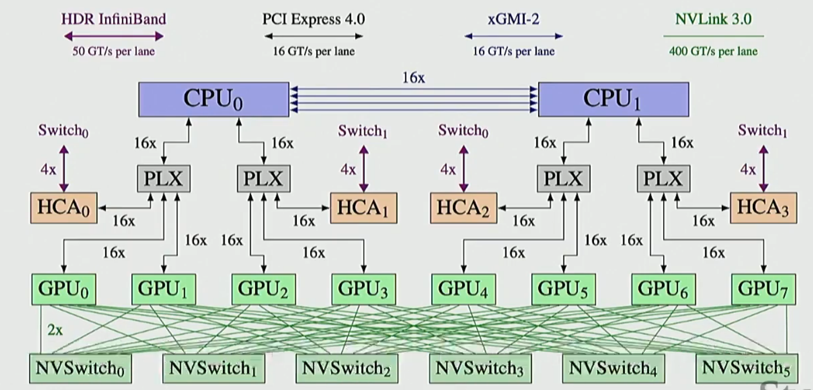

节点内部的 GPU 通常通过 NVLink 或 NVSwitch 高速互联；不同节点之间则需要经过网卡和集群网络。因此，相同大小的数据在节点内传输通常比跨节点传输更快。


### 2.1 NCCL 通信原语

#### 2.1.1 Broadcast

Broadcast 将一个指定 root rank 上的完整张量复制到其他所有 rank。

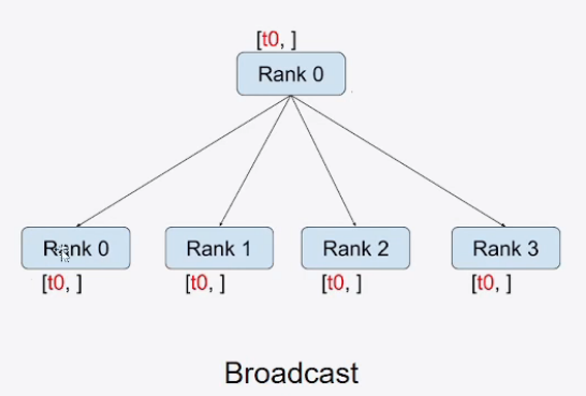

```text
通信前：rank 0 持有 T
通信后：所有 rank 都持有 T
```

#### 2.1.2 Scatter

Scatter 将 root rank 上的完整张量切成多个分片，并把不同分片发送给不同 rank。

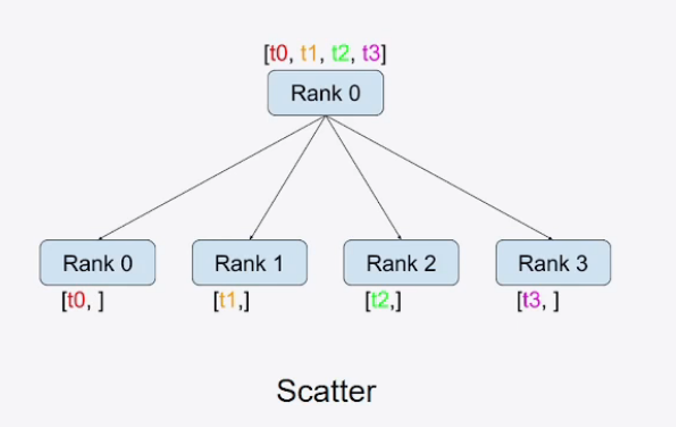

若 root 持有：

$$
T=[T_0,T_1,T_2,T_3]
$$

Scatter 后：

```text
rank 0：T0
rank 1：T1
rank 2：T2
rank 3：T3
```

#### 2.1.3 Gather

Gather 将所有 rank 持有的不同分片收集到一个指定 root rank，并在 root 上拼接成完整张量。

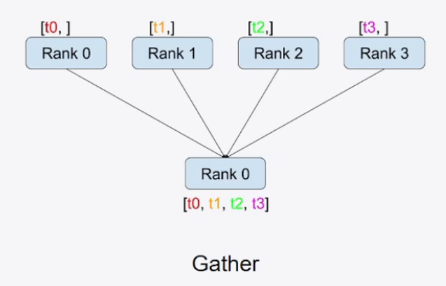

```text
通信前：rank i 持有 Ti
通信后：root 持有 [T0,T1,T2,T3]
```

#### 2.1.4 Reduce

Reduce 对所有 rank 的同形状张量逐元素执行求和、最大值等归约操作，但只把最终结果保存在 root rank。

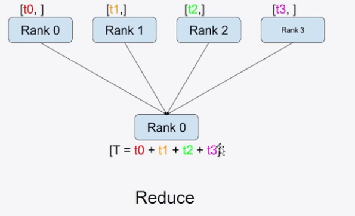

若各 rank 分别持有 $t_0,t_1,t_2,t_3$，执行求和 Reduce 后，root 得到：

$$
T=t_0+t_1+t_2+t_3
$$

#### 2.1.5 All-Reduce

All-Reduce 对所有 rank 的对应元素进行归约，并使每个 rank 都得到完整结果。

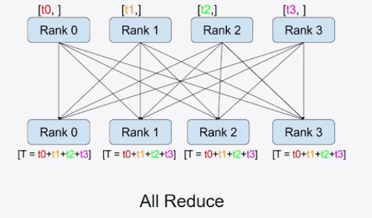

#### 2.1.6 Reduce-Scatter

Reduce-Scatter 包含两个过程：

1. **Reduce**：对所有 rank 的输入逐元素归约；
2. **Scatter**：将归约后的完整结果切分，每个 rank 只获得一个分片。

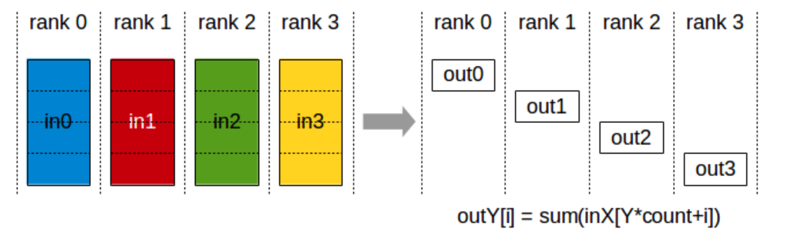

#### 2.1.7 All-Gather

All-Gather 收集所有 rank 持有的不同分片，并使每个 rank 都获得拼接后的完整张量。

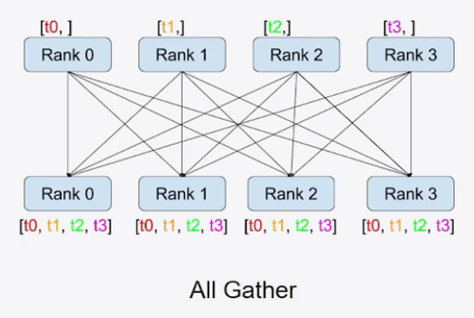


#### 2.1.8 ring-all-reduce
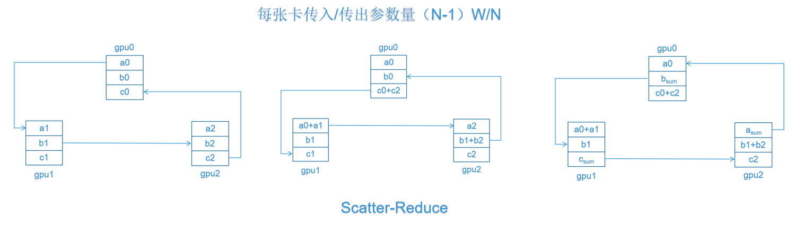
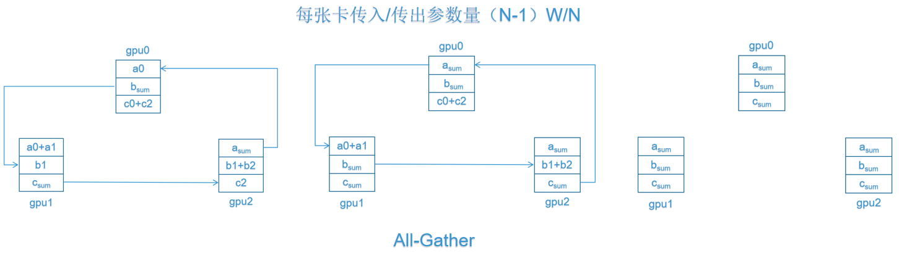
所以all-reduce等价于reduce-scatter + all-gather

| 原语 | 单 rank 通信量 |
|---|---:|
| Reduce-Scatter | $\frac{N-1}{N}S$ |
| All-Gather | $\frac{N-1}{N}S$ |
| All-Reduce | $2\frac{N-1}{N}S$ |

**与蝴蝶式规约（recursive halving + recursive doubling）的对比：** 两者都可将 all-reduce 拆为 reduce-scatter 和 all-gather。设总张量大小为 $S$，且 $N$ 为参与通信的 rank 数；当张量可均分为 $N$ 段且网络无争用时，两者的单 rank 总通信量同为 $2\frac{N-1}{N}S$，均可达到带宽下界。差别主要在通信轮数和对网络拓扑的要求。

| 维度 | Ring All-Reduce | 蝴蝶式规约 |
|---|---|---|
| 通信配对 | 每轮只与固定的前驱/后继通信 | 每轮与二进制编号相差一位的 partner 通信 |
| 通信轮数 | $2(N-1)$ 轮：reduce-scatter 与 all-gather 各 $N-1$ 轮 | $2\log_2N$ 轮：递归折半与递归倍增各 $\log_2N$ 轮（标准形式要求 $N$ 为 2 的幂） |
| 单 rank 总通信量 | $2\frac{N-1}{N}S$ | $2\frac{N-1}{N}S$（带宽最优的 reduce-scatter + all-gather 实现） |
| 网络争用 | 邻居通信容易映射到树、胖树等拓扑，通常更容易避免争用 | 同时发生的跨组通信较多，在 SMP/多交换机等实际拓扑上可能竞争相同链路 |
| 额外工作内存（典型实现） | 约 $\frac{S}{N}$，一次处理一个分段 | 约 $\frac{S}{2}$，首轮可能需暂存一半数据 |
| 延迟特性 | 轮数随 $N$ 线性增长，小张量时不利 | 轮数随 $\log N$ 增长，小张量或高延迟网络中通常更有优势 |

因此，大张量梯度同步时，Ring 往往因带宽利用率稳定、较少网络争用而表现良好；小张量或对启动延迟特别敏感时，蝴蝶式算法可能更合适。实际框架（如 NCCL）会结合消息大小、GPU/网络拓扑和硬件能力选择或混合不同算法。

**为什么连续 rank 的 Ring 能适应图中的两层 SMP 树形拓扑：**

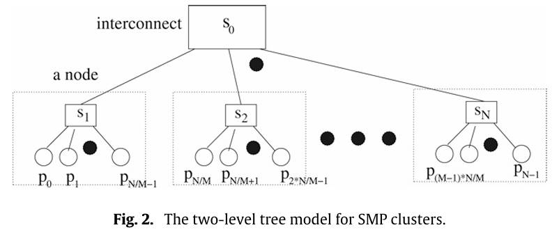

图中根节点/交换网络为 $S_0$；每个虚线框是一台 SMP 节点，节点内的交换点为 $S_1,S_2,\ldots$，下方圆点是该节点内的 CPU 核或进程。若调度器将连续 rank 分配到同一 SMP 节点，例如每个节点有 $q$ 个 rank：

```text
节点 0: p0, p1, ..., p(q-1)
节点 1: pq, p(q+1), ..., p(2q-1)
...
```

则连续 rank 的逻辑环 $p_0 \rightarrow p_1 \rightarrow \cdots \rightarrow p_{N-1} \rightarrow p_0$ 会自然分解为两类边：

- **节点内边：** 如 $p_0\rightarrow p_1$。通信经同一 SMP 节点内的共享内存/本地互连完成，不占用 $S_0$ 的跨节点链路；
- **节点间边：** 只出现在两个连续节点的交界处，如 $p_{q-1}\rightarrow p_q$，以及环闭合边 $p_{N-1}\rightarrow p_0$。它们通过“本节点 $\rightarrow S_0 \rightarrow$ 对端节点”的唯一路径传输。

在一次 Ring 的通信轮中，每个 SMP 节点至多有一条跨节点数据流离开、并至多有一条跨节点数据流进入；其余均为节点内通信。因此，任意一条节点到 $S_0$ 的上行/下行链路不会被多条不同的 Ring 流同时争用（假设每个节点一张全双工网卡/网络端口）。这正是该逻辑环在此树上无竞争的原因。

相比之下，蝴蝶式规约会在同一轮让多个 rank 与二进制距离不同的 partner 通信；这些 partner 往往跨越多个 SMP 节点。许多流量可能同时经过同一节点上行链路或交换网络链路，从而产生争用。Ring 并非在所有拓扑上天然无竞争，但“连续 rank 与节点局部性对齐”时，它只需要树形网络的最小连通结构，因而特别容易映射到这类 SMP/多核集群。


## 3. 混合精度与训练显存

混合精度训练的基本思路是：让计算量大、适合 Tensor Core 的前向和反向运算尽量使用 FP16，同时在容易发生数值误差的环节保留 FP32。

这样既能降低参数和激活的存储、访存及通信开销，又能尽量保持与 FP32 训练相近的收敛效果。

### 3.1 梯度的数值范围

神经网络不同层、不同参数的梯度大小可能相差很多。下面的直方图来自 Mixed Precision Training 论文中的一次语音模型训练，横轴表示梯度数值的二进制指数，纵轴表示该区间内梯度占总梯度的比例。

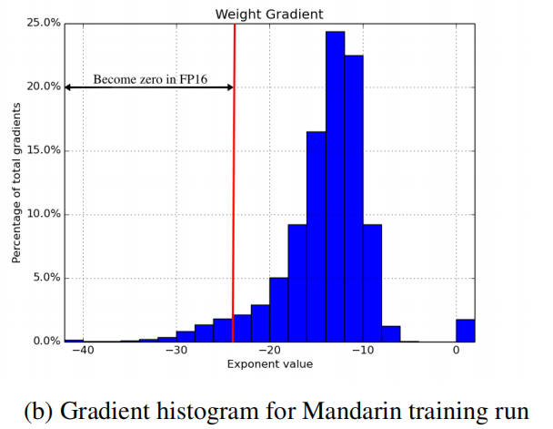

从图中可以看到：

- 梯度主要集中在较小的数值范围；
- 一部分梯度的指数低于 $-24$；
- 这些梯度虽然很小，但数量并非一定可以忽略；
- 若直接使用 FP16 存储，它们会发生下溢并变成 0。

因此，混合精度训练的核心困难不是只把 FP32 张量转换成 FP16，而是如何避免有用的小梯度在转换和计算过程中丢失。

### 3.2 IEEE FP16 的表示范围

IEEE FP16,由以下部分组成：

| 部分 | 位数 |
|---|---:|
| 符号位 | 1 |
| 指数位 | 5 |
| 尾数位 | 10 |

FP16 的几个关键数值为：

| 数值 | 大小 |
|---|---:|
| 最大有限值 | $65504$ |
| 最小正规正数 | $2^{-14}\approx6.10\times10^{-5}$ |
| 最小次正规正数 | $2^{-24}\approx5.96\times10^{-8}$ |

FP16 能表示 $2^{-14}$ 以下的次正规数，但精度会逐渐下降。绝对值小于约 $2^{-24}$ 的数无法表示，舍入后会变成 0。

#### 梯度变 0

如果真实梯度为：

$$
g=2^{-30}
$$

由于：

$$
2^{-30}<2^{-24}
$$

它转换为 FP16 后会下溢为 0。这个参数在当前训练步中就无法获得该梯度提供的更新信息。

即使梯度本身暂时可由 FP16 表示，乘上较小的学习率后也可能进一步下溢。例如：

$$
g=2^{-20},\qquad \eta=2^{-10}
$$

参数更新量为：

$$
\Delta w=\eta g=2^{-30}
$$

若直接在 FP16 中计算和保存更新量，$\Delta w$ 仍会变成 0。

#### 大数吃小数

FP16 只有 10 位显式尾数，加上隐藏的最高位，有效精度约为 11 个二进制位。当两个数量级差距较大的数相加时，较小数的有效位会在对齐指数和舍入过程中被丢弃。

例如：

$$
w=1,\qquad \Delta w=2^{-12}
$$

执行参数更新：

$$
w_{\text{new}}=w+\Delta w
$$

时，$\Delta w$ 相比 $w$ 太小，FP16 可能将结果舍入回 1，使这次更新没有真正写入参数。

一般来说，当权重与更新量的比例达到约 $2^{11}=2048$ 或更高时，小更新就可能低于当前权重附近的 FP16 分辨率。这就是通常所说的“大数吃小数”。

解决办法是保留一份 FP32 主参数。FP32 具有更高的尾数精度，可以累积这些相对较小的更新。

### 3.3 混合精度训练流程

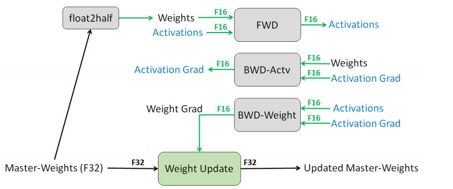

混合精度训练同时维护：

- 一份用于前向和反向计算的 FP16 参数；
- 一份用于优化器更新的 FP32 master weights。

一次训练迭代可以分为以下步骤。

#### 1. 生成 FP16 参数

将 FP32 master weights 转换为 FP16：

$$
w_{16}={cast}_{16}(w_{32})
$$

#### 2. FP16 前向传播

使用 FP16 参数和激活执行主要的矩阵乘法、卷积等计算：

$$
\hat y=f(x;w_{16})
$$

得到 loss 后，不直接对原始 loss 反向传播，而是先进行损失放缩。

#### 3. 损失放缩

设损失放缩因子为 $S$，构造：

$$
L_{\text{scaled}}=S L
$$

反向传播的梯度为：

$$
\nabla_w L_{\text{scaled}}
=
S\nabla_w L
$$

损失乘以 $S$ 后，所有梯度也会放大 $S$ 倍。例如：

$$
2^{-30}\times2^{10}=2^{-20}
$$

原本会在 FP16 中变成 0 的梯度，被移动到 FP16 可表示范围内。

损失放缩不会改变最终参数更新，因为优化器更新前会执行反放缩：

$$
g=\frac{g_{\text{scaled}}}{S}
$$

正确顺序通常是：

```text
loss × S
   ↓
反向传播得到放大的 FP16 梯度
   ↓
将梯度转换或累积到 FP32
   ↓
梯度除以 S
   ↓
检查 Inf/NaN，执行梯度裁剪
   ↓
FP32 优化器更新
```

梯度裁剪必须作用在反放缩后的真实梯度上，否则裁剪阈值的含义会被放缩因子改变。

#### 4. 动态损失放缩

放缩因子太小，仍会有梯度下溢；放缩因子太大，则可能使梯度超过 FP16 最大值 $65504$，产生 Inf 或 NaN。

因此实践中通常使用动态损失放缩：

1. 先使用较大的 $S$；
2. 若检测到 Inf/NaN，则跳过本次参数更新并减小 $S$；
3. 若连续多个训练步没有溢出，则尝试增大 $S$。

其目标是在“不发生溢出”的前提下，尽可能把小梯度移动到 FP16 的有效表示范围。

#### 5. FP32 参数更新

反放缩后的梯度用于更新 FP32 master weights：

$$
w_{32}\leftarrow{Optimizer}(w_{32},g)
$$

下一轮训练再将新的 $w_{32}$ 转换成 $w_{16}$。因此：

- FP16 参数负责高吞吐前向和反向；
- FP32 参数负责精确累积小更新；
- loss scaling 负责避免小梯度在 FP16 中下溢。

### 3.4 哪些计算通常保留 FP32

混合精度并不意味着所有操作都必须使用 FP16。对数值范围或累加误差敏感的操作通常使用 FP32 输入、FP32 累加，或者至少使用 FP32 中间结果。

常见情况包括：

1. **优化器状态和参数更新**

   FP32 master weights、Adam 一阶动量和二阶方差通常保留 FP32。

2. **大规模归约和累加**

   点积、矩阵乘法的乘数可以是 FP16，但部分和通常使用 FP32 累加。梯度范数、loss 求和等大规模 reduction 也常使用 FP32。

3. **Softmax**

   Softmax 中的指数运算容易溢出或下溢，通常先减去最大值，并在 FP32 中完成关键计算。

4. **LayerNorm**

   均值、方差和归一化计算对舍入误差敏感，统计量通常使用 FP32 计算。

5. **损失函数**

   Cross-Entropy、log、exp 等涉及概率和对数的计算通常保留 FP32，以避免极小概率下溢或数值不稳定。

6. **梯度反放缩、溢出检测和梯度裁剪**

   这些操作决定是否执行参数更新，通常在 FP32 梯度上完成。

### 3.5 Adam 训练显存与参数量

设第 $t$ 步的梯度为 $g_t$。Adam 会为每个参数维护一阶动量 $m_t$ 和二阶矩 $v_t$：

$$
m_t=\beta_1m_{t-1}+(1-\beta_1)g_t
$$

$$
v_t=\beta_2v_{t-1}+(1-\beta_2)g_t^2
$$

为了修正训练初期 $m_t$ 和 $v_t$ 偏向 0 的问题，Adam 使用偏差修正：

$$m_t^{\mathrm{corrected}}=\frac{m_t}{1-\beta_1^t}$$

$$v_t^{\mathrm{corrected}}=\frac{v_t}{1-\beta_2^t}$$

最后更新 FP32 主参数：

$$w_t=w_{t-1}-\eta\frac{m_t^{\mathrm{corrected}}}{\sqrt{v_t^{\mathrm{corrected}}}+\epsilon}$$

因此，除了参数和梯度，Adam 还必须为每个参数长期保存 $m_t$ 和 $v_t$。混合精度训练通常将 FP32 主参数、$m_t$ 和 $v_t$ 都保留为 FP32。

设模型参数量为 $\Psi$：

| 模型状态 | 精度 | 每个参数占用 |
|---|---:|---:|
| 前向/反向使用的参数 | FP16 | 2 字节 |
| 梯度 | FP16 | 2 字节 |
| FP32 master weights | FP32 | 4 字节 |
| Adam 一阶动量 $m$ | FP32 | 4 字节 |
| Adam 二阶方差 $v$ | FP32 | 4 字节 |
| 合计 |  | 16 字节 |

因此，仅模型状态所需显存约为：

$$
M_{\text{state}}=16\Psi\ \text{bytes}
$$


## 4. 数据并行、ZeRO 与 FSDP

### 4.1 普通数据并行 DP

数据并行（Data Parallelism，DP），每个进程都保存一份完整模型，但处理不同的batch。

```text
GPU 0: 完整模型 + 数据 D0 → 前向 → 反向 → 本地梯度 G0
GPU 1: 完整模型 + 数据 D1 → 前向 → 反向 → 本地梯度 G1
                         ...
              梯度 All-Reduce 求和或平均
                         ↓
              每张 GPU 得到相同的完整梯度
                         ↓
              各自执行相同的优化器更新
```

因为初始参数相同、聚合后的梯度相同，所以更新后每张 GPU 上的参数仍然相同。

#### 4.1.1 模型状态显存

设模型参数量为 $\Psi$。按照第三章介绍的 FP16 混合精度 Adam 记账方式，每个参数需要保存：

| 模型状态 | 精度 | 单参数显存 |
|---|---:|---:|
| 计算使用的参数 | FP16 | 2 Byte |
| 梯度 | FP16 | 2 Byte |
| FP32 主参数 | FP32 | 4 Byte |
| Adam 一阶动量 | FP32 | 4 Byte |
| Adam 二阶动量 | FP32 | 4 Byte |

因此，普通 DP 中每张 GPU 的模型状态显存为：

$$M_{\mathrm{DP}}=(2+2+12)\Psi=16\Psi\ \mathrm{Byte}$$

#### 4.1.2 通信开销
若完整梯度包含 $\Psi$ 个元素，则每个进程的精确通信量为：

$$V_{\mathrm{DP}}=2\frac{N_d-1}{N_d}\Psi$$

当 $N_d$ 较大时，通常近似记为：

$$V_{\mathrm{DP}}\approx2\Psi$$


### 4.2 ZeRO 的三个阶段

ZeRO 仍然保持数据并行的大粒度计算方式，但依次对**优化器状态、梯度和参数**进行分片。图中蓝色、橙色和绿色分别表示参数、梯度和优化器状态。

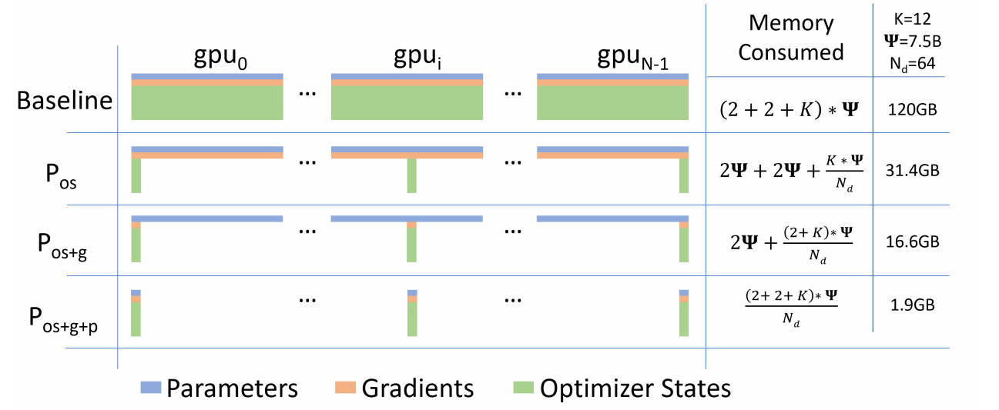

#### 4.2.1 ZeRO-1：优化器状态分片

ZeRO-1 只对优化器状态进行分片。把 FP32 主参数、Adam 一阶动量和二阶动量平均分成 $N_d$ 份，进程 $i$ 只保存并更新第 $i$ 份。

每个进程长期保存：

- 完整 FP16 参数：$2\Psi$；
- 完整 FP16 梯度：$2\Psi$；
- $1/N_d$ 的优化器状态：$12\Psi/N_d$。

**一次训练的流程如下：**

```text
1. 每个进程使用完整 FP16 参数，对不同数据执行前向传播。
2. 每个进程执行反向传播，得到本地完整梯度。
3. 对梯度进行Reduce-Scatter，使进程 i 得到自己负责参数分片的聚合梯度。
4. 进程 i 使用本地优化器状态，只更新自己负责的 FP32 主参数和 FP16 参数分片。
5. 对更新后的 FP16 参数分片执行 All-Gather。
6. 每个进程重新获得完整且一致的 FP16 参数，进入下一训练步。
```
ZeRO-1 的单卡模型状态显存为：

$$M_{\mathrm{Z1}}=2\Psi+2\Psi+\frac{12\Psi}{N_d}=4\Psi+\frac{12\Psi}{N_d}$$

ZeRO-1 的通信包括：

$$V_{\mathrm{Z1}}\approx\underbrace{\Psi}_{\text{梯度Reduce-Scatter}}+\underbrace{\Psi}_{\text{参数 All-Gather}}=2\Psi$$

#### 4.2.2 ZeRO-2：优化器状态与梯度分片

ZeRO-2 在 ZeRO-1 的基础上进一步对梯度分片。进程 $i$ 只长期保存自己负责的聚合梯度，不再保存完整梯度。

**一次训练的流程如下：**

```text
1. 每个进程使用完整 FP16 参数执行前向传播。
2. 反向传播逐层产生本地梯度，并将梯度放入通信 bucket。
3. bucket 就绪后执行 Reduce-Scatter。
4. 进程 i 只保留自己负责参数分片的聚合梯度，其余梯度可以释放。
5. 进程 i 使用本地梯度和优化器状态更新自己的参数分片。
6. 对更新后的 FP16 参数分片执行 All-Gather。
7. 每个进程重新获得完整 FP16 参数。
```

ZeRO-2 中每个进程保存完整 FP16 参数，以及 $1/N_d$ 的梯度和优化器状态：

$$M_{\mathrm{Z2}}=2\Psi+\frac{2\Psi+12\Psi}{N_d}=2\Psi+\frac{14\Psi}{N_d}$$

ZeRO-2 的通信量仍然是：

$$V_{\mathrm{Z2}}\approx\underbrace{\Psi}_{\text{梯度 Reduce-Scatter}}+\underbrace{\Psi}_{\text{参数 All-Gather}}=2\Psi$$

#### 4.2.3 ZeRO-3：优化器状态、梯度与参数分片

ZeRO-3 进一步将 FP16 参数也平均分片。每个进程长期只保存 $1/N_d$ 的参数、梯度和优化器状态。

参数被分片后，单个进程无法独立计算一个完整网络层。因此，ZeRO-3 会在每层真正参与计算之前临时收集该层参数。

**一次训练的流程如下：**

```text
前向传播第 l 层：
参数 All-Gather
→ 临时物化第 l 层的完整参数
→ 执行第 l 层前向计算
→ 释放不属于本进程的参数

反向传播第 l 层：
再次 All-Gather 第 l 层参数
→ 执行第 l 层反向计算
→ 对梯度执行 Reduce-Scatter
→ 每个进程仅保留自己的梯度分片
→ 释放临时完整参数

优化器更新：
每个进程使用本地梯度和优化器状态
→ 更新自己的 FP32 主参数及 FP16 参数分片
```

前向和反向阶段都需要参数，是因为反向传播不仅需要激活值，还需要该层权重来计算输入梯度和参数梯度。为了降低峰值显存，完整参数只按层或模块临时物化，用完立即释放。

ZeRO-3 的单卡模型状态显存为：

$$M_{\mathrm{Z3}}=\frac{2\Psi+2\Psi+12\Psi}{N_d}=\frac{16\Psi}{N_d}$$


ZeRO-3 每步包含三类主要通信：

$$V_{\mathrm{Z3}}\approx\underbrace{\Psi}_{\text{前向参数 All-Gather}}+\underbrace{\Psi}_{\text{反向参数 All-Gather}}+\underbrace{\Psi}_{\text{梯度 Reduce-Scatter}}=3\Psi$$

与普通 DP 相比：

$$\frac{V_{\mathrm{Z3}}}{V_{\mathrm{DP}}}\approx\frac{3\Psi}{2\Psi}=1.5$$

因此，ZeRO-3 用最多约 1.5 倍于普通 DP 的通信量，换取模型状态显存随 $N_d$ 近似线性下降。


### 4.3 ZeRO-R：优化剩余显存

ZeRO-1/2/3 优化的是参数、梯度和优化器状态。训练显存中还包括激活值、临时缓冲区和无法有效利用的碎片，ZeRO 将这些统称为 residual states，并通过 ZeRO-R 进行优化。

#### 4.3.1 分片激活检查点

激活检查点通过“少保存、反向时重计算”降低激活显存，但在张量并行中，某些层的输入激活仍会在张量并行进程之间复制。

ZeRO-R 将激活检查点在 $N_m$ 个模型并行进程之间分片。每个进程只长期保存 $1/N_m$ 的检查点，在反向传播真正需要该检查点时再执行 All-Gather：

```text
前向传播：
生成激活检查点
→ 沿模型并行组切分
→ 每个进程只保存一个 activation shard

反向传播：
activation All-Gather
→ 临时恢复完整检查点
→ 重计算该层前向
→ 执行反向计算
→ 释放完整检查点
```

#### 4.3.2 固定大小临时缓冲区

All-Reduce、梯度范数计算等操作通常会把大量小张量合并到连续的 fused buffer 中，以提高通信带宽和计算效率。如果直接把整个模型的梯度合并到一个 FP32 buffer，其大小会随模型参数量线性增长：

$$M_{\mathrm{buffer}}=4\Psi\ \mathrm{Byte}$$

例如，30 亿参数对应的完整 FP32 buffer 需要约 12 GB。ZeRO-R 不使用与整个模型一样大的缓冲区，而是预先设置一个固定且足够高效的 bucket 容量，分批处理参数或梯度：

```text
模型张量 → 填满固定大小 bucket → 执行通信或计算
         → 复用同一 bucket 处理下一批张量
```

这样既能维持较大的通信消息和较高带宽，又能防止临时缓冲区随模型规模无限增长。

#### 4.3.3 显存碎片整理

训练中会同时出现生命周期不同的张量：

- 长生命周期：激活检查点、参数梯度；
- 短生命周期：普通中间激活、激活梯度、临时计算 buffer。

如果二者交错申请和释放，空闲显存会被分割成许多不连续的小块。即使空闲显存总量足够，也可能因为找不到足够大的连续区域而 OOM。

ZeRO-R 会预先申请连续内存，将长生命周期的激活检查点和参数梯度移动或直接写入专用连续 buffer，使其他区域主要由短生命周期张量循环复用。这样可以：

- 减少显存碎片导致的意外 OOM；
- 提高可用连续显存；
- 减少内存分配器搜索空闲块的开销。

因此，ZeRO-DP 负责消除模型状态冗余，ZeRO-R 负责优化激活、临时缓冲区和显存碎片，两者共同构成完整的 ZeRO 显存优化体系。


## 5. Megatron 张量并行 TP

张量并行（Tensor Parallelism，TP）是在单个网络层内部切分参数和计算。与流水线并行按层切分不同，TP 组内的所有 GPU 会共同计算同一个 Transformer 层。

### 5.1 MLP 的张量并行

Transformer 的 MLP 包含两个线性层：

$$Y=GeLU(XA),\qquad Z=Dropout(YB)$$

其中：

$$X\in\mathbb{R}^{s\times b\times h},\qquad A\in\mathbb{R}^{h\times4h},\qquad B\in\mathbb{R}^{4h\times h}$$

这里 $s$ 是序列长度，$b$ 是 micro-batch size，$h$ 是隐藏维度。下面以两路 TP 为例。

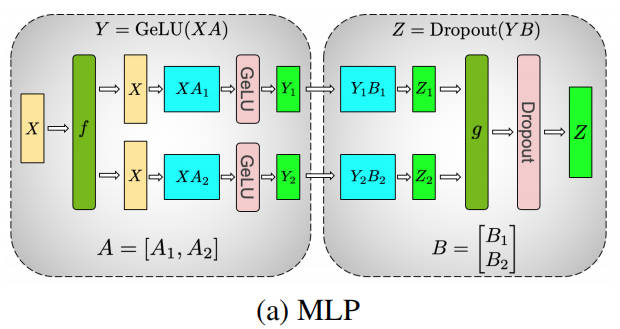

#### 5.1.1 第一层：列并行

第一层权重 $A$ 沿列方向，也就是输出维度 $4h$ 切分：

$$A=[A_1,A_2],\qquad A_i\in\mathbb{R}^{h\times2h}$$

输入 $X$ 在两个 GPU 上各保存一份。每张 GPU 使用相同的完整输入与自己的权重分片相乘：

$$Y_1=GeLU(XA_1),\qquad Y_2=GeLU(XA_2)$$

因此：

$$Y=[Y_1,Y_2]$$

$Y_1$ 和 $Y_2$ 分别是完整结果在隐藏维度上的一部分。GeLU 是逐元素操作，可以直接在各自的输出分片上独立执行，所以第一层 GEMM 和 GeLU 之间不需要通信。

如果反过来按 $A$ 的行切分，每张 GPU 只能算出输出的部分和，必须先进行归约才能执行非线性的 GeLU，这会在两次 GEMM 之间引入额外通信。

#### 5.1.2 第二层：行并行

第二层权重 $B$ 沿行方向，也就是输入维度 $4h$ 切分：

$$B=\begin{bmatrix}B_1\\B_2\end{bmatrix},\qquad B_i\in\mathbb{R}^{2h\times h}$$

该切分方式正好与上一层的输出分片对应，因此 $Y_1$ 可以直接输入 $B_1$，$Y_2$ 可以直接输入 $B_2$：

$$Z_1=Y_1B_1,\qquad Z_2=Y_2B_2$$

这里的 $Z_1$ 和 $Z_2$ 不是最终输出的不同切片，而是形状相同的**部分和**。完整结果为：

$$Z=YB=Y_1B_1+Y_2B_2=Z_1+Z_2$$

因此，需要对各 GPU 的部分和执行 All-Reduce：

```text
GPU 0: Z1 ─┐
           ├─ All-Reduce(SUM) → GPU 0、GPU 1 都得到完整 Z
GPU 1: Z2 ─┘
```

归约完成后再执行 Dropout、残差连接和 LayerNorm 等操作。

#### 5.1.3 MLP 前向与反向通信

图中的 $f$ 和 $g$ 是一对共轭通信算子：

| 算子 | 前向传播 | 反向传播 |
|---|---|---|
| $f$ | Identity，不通信 | 对输入梯度执行 All-Reduce |
| $g$ | 对输出部分和执行 All-Reduce | Identity，不通信 |

完整流程可以概括为：

```text
前向：
复制的 X
→ 列并行 A
→ 分片的 Y
→ 行并行 B
→ 输出 All-Reduce
→ 复制的 Z

反向：
复制的 dZ
→ 行并行层反向
→ 分片的 dY
→ 列并行层反向
→ 输入梯度 All-Reduce
→ 复制的 dX
```

因此，一个 MLP 模块在一次完整的前向和反向中总共需要两次 All-Reduce：

- 前向：归约第二层产生的输出部分和；
- 反向：归约第一层产生的输入梯度部分和。

### 5.2 Attention 的张量并行

多头注意力天然包含多个彼此独立的注意力头，因此可以沿注意力头维度切分。设总注意力头数为 $a$，TP 并行度为 $t$，则每张 GPU 负责 $a/t$ 个注意力头。

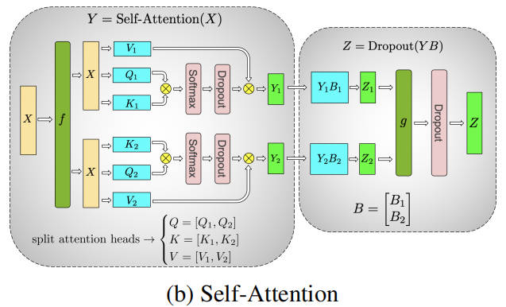

#### 5.2.1 Q、K、V 投影：列并行

将 Q、K、V 的投影矩阵沿输出维度切分。以两路 TP 为例：

$$W_Q=[W_{Q1},W_{Q2}],\qquad W_K=[W_{K1},W_{K2}],\qquad W_V=[W_{V1},W_{V2}]$$

每张 GPU 使用完整输入 $X$，只计算自己负责的注意力头：

$$Q_i=XW_{Qi},\qquad K_i=XW_{Ki},\qquad V_i=XW_{Vi}$$

随后，各 GPU 可以完全独立地计算本地注意力：

$$S_i=Softmax\left(\frac{Q_iK_i^{T}}{\sqrt{d_k}}\right)$$

$$Y_i=S_iV_i$$

不同注意力头之间没有数据依赖，因此 QKV 投影、$QK^T$、Softmax 和对 $V$ 的加权求和均不需要 TP 通信。

#### 5.2.2 输出投影：行并行

拼接所有注意力头后，注意力结果可写为：

$$Y=[Y_1,Y_2]$$

输出投影权重按输入维度进行行切分：

$$W_O=\begin{bmatrix}W_{O1}\\W_{O2}\end{bmatrix}$$

每张 GPU 计算一个完整输出形状的部分和：

$$Z_1=Y_1W_{O1},\qquad Z_2=Y_2W_{O2}$$

最终结果需要求和：

$$Z=Z_1+Z_2$$

所以 Attention 输出投影之后需要一次 All-Reduce。反向传播时，在 QKV 列并行投影的输入端还需要一次 All-Reduce，以得到完整的输入梯度。

Attention 与 MLP 的并行结构实际上相同：

```text
完整输入
→ 列并行投影
→ 可独立执行的操作
→ 行并行投影
→ All-Reduce 恢复完整输出
```

- MLP 中可独立执行的是 GeLU；
- Attention 中可独立执行的是不同注意力头的注意力计算。


### 5.3 为什么 TP 通常限制在单节点

TP 通信发生在每个 Transformer 层、每个 batch 的前向和反向中，频率远高于每个训练步只同步一次梯度的数据并行。

因此常见原则：
> 对于每个节点包含 $g$ 张 GPU 的集群，TP 通常不超过 $g$，将高频通信限制在 NVLink/NVSwitch 域内；需要扩展到更多节点时，再使用流水线并行和数据并行。

## 6. 流水线并行 PP

流水线并行（Pipeline Parallelism，PP）沿模型深度方向切分网络：不同 GPU 保存不同的连续层，并通过点对点通信传递激活值和激活梯度。

### 6.1 基本概念

下图展示了张量并行与流水线并行的组合。虚线区域表示一个 Transformer 层内部的张量并行分片，绿色实线区域表示由若干连续 Transformer 层组成的流水线分区。

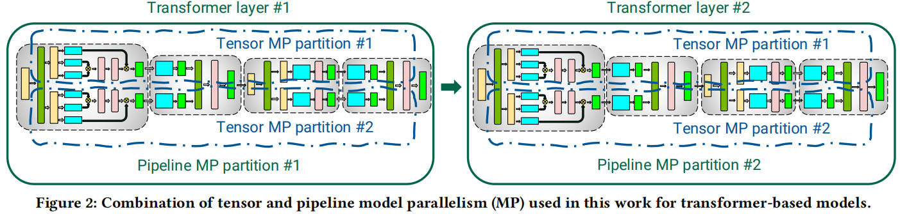

例如，将一个 40 层模型切成 4 个流水线阶段：

```text
Stage 0 / GPU 0：Layer 1  - 10
Stage 1 / GPU 1：Layer 11 - 20
Stage 2 / GPU 2：Layer 21 - 30
Stage 3 / GPU 3：Layer 31 - 40
```

一次前向传播的过程为：

```text
输入数据
→ Stage 0 计算并发送激活
→ Stage 1 计算并发送激活
→ Stage 2 计算并发送激活
→ Stage 3 计算并产生 loss
```

反向传播按照相反方向传递激活梯度：

```text
Stage 3
→ Stage 2
→ Stage 1
→ Stage 0
```

流水线并行将参数和计算分配到不同设备，但相邻 stage 之间必须通信：

- 前向传播发送边界激活；
- 反向传播发送边界激活梯度。

### 6.2 朴素流水线：大量 Pipeline Bubble

如果直接把一个完整 batch 依次送过各个 stage，那么任意时刻通常只有一张 GPU 在计算，其余 GPU 都处于等待状态。


图中 $F$ 表示前向计算，$B$ 表示反向计算。以 4 个 stage 为例：

```text
Stage 0 做前向时：Stage 1、2、3 空闲
Stage 1 做前向时：Stage 0、2、3 空闲
Stage 3 做反向时：Stage 0、1、2 空闲
```

这些因为数据依赖而无法工作的空闲区域称为 **Pipeline Bubble（流水线气泡）**。如果所有 stage 的计算时间相同，朴素调度的设备利用率大约只有 $1/p$，阶段越多，资源浪费越严重。

解决方法是将一个 batch 切成多个更小的 micro-batch，让不同 stage 同时处理不同的 micro-batch。

### 6.3 GPipe：用 Micro-Batch 填充流水线

设全局 batch 在每条数据并行流水线上包含 $m$ 个 micro-batch。GPipe 采用 **All-Forward, All-Backward** 调度：

1. 依次注入全部 $m$ 个 micro-batch；
2. 所有 stage 先完成全部前向传播；
3. 再以相反顺序完成全部反向传播；
4. 流水线排空后统一执行优化器更新。

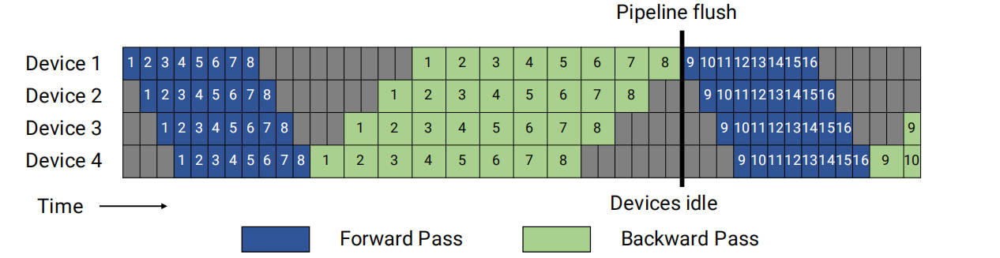

图中蓝色表示前向传播，绿色表示反向传播，灰色表示设备空闲。不同 stage 可以同时处理不同编号的 micro-batch，因此设备利用率显著高于朴素调度。

#### 6.3.1 Bubble 与 Micro-Batch 数量的关系

设：

- 流水线阶段数为 $p$；
- micro-batch 数量为 $m$；
- 一个 micro-batch 在单个 stage 上的前向时间为 $t_f$；
- 反向时间为 $t_b$。

开始时，数据需要经过前 $p-1$ 个 stage 才能填满流水线；结束时，还需要等待剩余任务依次排空。因此气泡时间为：

$$t_{\mathrm{bubble}}=(p-1)(t_f+t_b)$$

忽略气泡时，处理 $m$ 个 micro-batch 的理想计算时间为：

$$t_{\mathrm{ideal}}=m(t_f+t_b)$$

因此，相对于理想计算时间的气泡比例为：

$$\text{Bubble ratio}=\frac{t_{\mathrm{bubble}}}{t_{\mathrm{ideal}}}=\frac{p-1}{m}$$

可以得到两个结论：

- $m$ 固定时，流水线阶段 $p$ 越多，气泡越大；
- $p$ 固定时，micro-batch 数 $m$ 越多，气泡占比越小。

为了获得较高利用率，通常希望：

$$m\gg p$$

#### 6.3.2 GPipe 的激活显存问题

GPipe 在执行反向传播之前，已经完成了全部 $m$ 个 micro-batch 的前向传播。为了计算梯度，每个 stage 必须为这 $m$ 个 micro-batch 保存激活值：

$$M_{\mathrm{activation}}^{\mathrm{GPipe}}\propto m$$

因此，增加 $m$ 虽然可以减小气泡，却会线性增加激活显存，形成直接矛盾：

```text
更多 micro-batch
→ 流水线利用率提高
→ 需要同时保存更多尚未反向的激活
→ 激活显存增加
```

### 6.4 PipeDream-Flush：1F1B

1F1B 表示在流水线稳定阶段，每个 stage 交替执行一次前向传播和一次反向传播。为了保持严格同步的优化器语义，Megatron 使用带流水线排空的 PipeDream-Flush 调度。

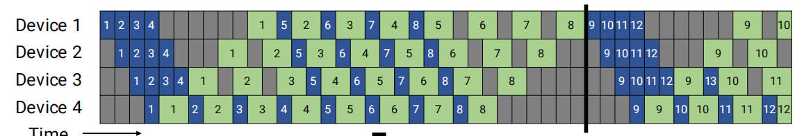

整个调度分为三个阶段：

1. **Warm-up**：各 stage 先执行不同数量的前向传播，将流水线填满。
2. **Steady state**：每个 stage 交替执行一次前向和一次反向，即 1F1B。
3. **Cool-down**：停止注入新的前向任务，完成剩余反向传播并排空流水线。

在稳定阶段，一个 micro-batch 完成前向后，会较快地开始反向传播，其激活可以随之释放，而不必等待全部 $m$ 个 micro-batch 完成前向。

与 GPipe 相比：

| 项目 | GPipe | 1F1B |
|---|---|---|
| 稳定阶段顺序 | 全部前向后全部反向 | 前向与反向交替 |
| 气泡大小 | $(p-1)/m$ | 基本相同 |
| 最大在途 micro-batch 数 | 约 $m$ | 约 $p$ |
| 激活显存 | 随 $m$ 增长 | 主要受 $p$ 限制 |

所以，普通 1F1B 的主要收益不是进一步缩小气泡，而是在保持相近吞吐率的同时，把需要保存激活的 micro-batch 数从约 $m$ 降到约 $p$。

### 6.5 交错式 1F1B

普通 1F1B 中，每张 GPU 只负责一个连续的模型分区。交错式 1F1B（Interleaved 1F1B）让每张 GPU 负责 $v$ 个不连续的 model chunk，也可理解为在一张物理 GPU 上放置多个虚拟流水线 stage。

例如，4 张 GPU、每张 GPU 原本负责 4 层：

```text
普通 PP：
GPU 0：Layer 1 - 4
GPU 1：Layer 5 - 8
GPU 2：Layer 9 - 12
GPU 3：Layer 13 - 16
```

当每张 GPU 负责 $v=2$ 个 model chunk 时：

```text
交错式 PP：
GPU 0：Layer 1 - 2， Layer 9  - 10
GPU 1：Layer 3 - 4， Layer 11 - 12
GPU 2：Layer 5 - 6， Layer 13 - 14
GPU 3：Layer 7 - 8， Layer 15 - 16
```

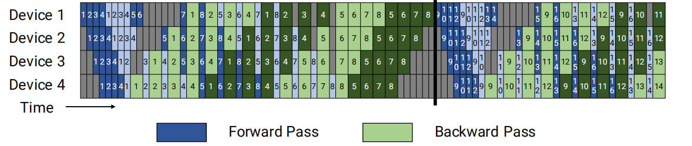

每个 model chunk 的计算量约为普通 stage 的 $1/v$，所以气泡中的每个空闲槽也缩短到原来的 $1/v$。气泡比例变为：

$$\text{Interleaved bubble ratio}=\frac{1}{v}\frac{p-1}{m}$$

也就是说，在理想负载均衡条件下，交错式调度可将气泡约缩小 $v$ 倍。

但这项收益不是免费的：

- 每张 GPU 负责多个 model chunk，调度更复杂；
- stage 边界数量增加，激活与激活梯度的 P2P 通信次数约增加 $v$ 倍；
- micro-batch 数通常需要是流水线并行度 $p$ 的整数倍；
- 需要保存的激活可能略有增加。

若每张 GPU 有 $v$ 个 model chunk，相关分析中第一 stage 的激活修正因子约为：

$$1+\frac{p-1}{pv}$$

因此，交错式 1F1B 适合通信带宽较高、普通流水线气泡已经成为主要瓶颈的场景。

### 6.6 Micro-Batch 大小的取舍

设全局 batch size 为 $B$，数据并行度为 $d$，单个 micro-batch size 为 $b$，则每条流水线需要处理的 micro-batch 数为：

$$m=\frac{B}{db}$$

增大 $b$：

- GEMM 规模变大，GPU 计算效率通常提高；
- 单个 micro-batch 的激活显存增加；
- $m$ 减小，流水线气泡占比提高。

减小 $b$：

- $m$ 增加，流水线气泡减小；
- GEMM 变小，Tensor Core 利用率可能下降；
- 调度和通信启动次数增加。

忽略通信时，GPipe 或 Flush 调度的 batch 计算时间可以近似为：

$$T_{\mathrm{batch}}(b)=\left(\frac{B}{db}+p-1\right)\left[t_f(b)+t_b(b)\right]$$

因此，最优 micro-batch size 需要在计算效率、激活显存和流水线气泡之间权衡，并不存在适用于所有模型和硬件的固定取值。

### 6.7 PP 边界的 Scatter/Gather 优化

当流水线并行和张量并行组合使用时，相邻 pipeline stage 之间可能位于不同节点，而每个 stage 内部又包含多个 TP rank。

经典 Megatron TP 的行并行层会在输出处执行 All-Reduce，因此同一个 TP 组的每个 rank 都保存一份相同的完整激活。如果直接进行 PP 通信，$t$ 个 TP rank 会分别向下一 stage 发送相同的完整激活，产生重复的跨节点传输。

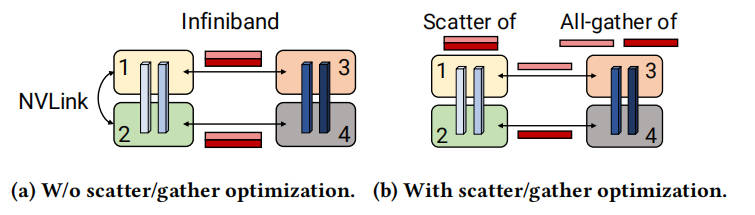

图中左侧是不使用优化的情况：

```text
节点 0 的 TP rank 1 → 跨节点发送完整激活 → 节点 1 的 TP rank 3
节点 0 的 TP rank 2 → 跨节点发送完整激活 → 节点 1 的 TP rank 4
```

由于 rank 1 和 rank 2 上的激活相同，完整数据通过 InfiniBand 重复发送了 $t$ 次。若激活包含 $bsh$ 个元素，则每个 rank 都需要跨节点发送：

$$V_{\mathrm{naive}}=bsh$$

图中右侧使用 Scatter/Gather 优化，流程为：

```text
发送节点：
每个 TP rank 从完整激活中取不同的 1/t 分片
→ t 个 rank 使用各自网卡并行跨节点发送

接收节点：
每个 TP rank 收到一个 1/t 激活分片
→ 通过节点内 NVLink 执行 All-Gather
→ 每个 rank 恢复完整激活
```

此时，每个 TP rank 的跨节点发送量降低为：

$$V_{\mathrm{optimized}}=\frac{bsh}{t}$$

跨节点总数据不再包含 $t$ 份重复激活，同时还能让多个 TP rank 使用各自的 InfiniBand 网卡并行发送。接收节点上的完整激活通过高带宽 NVLink All-Gather 恢复。

这项优化本质上是：

> 用一次高速的节点内 All-Gather，换掉重复且较慢的节点间数据传输。

它不会改变模型计算结果，主要用于降低 TP 与 PP 组合时的 pipeline stage 边界通信开销，并使通信更好地匹配“节点内 NVLink 快、节点间 InfiniBand 相对慢”的层次化网络。

## 7. PTD-P 三维并行

### 7.1 记号与并行组

| 记号 | 含义 |
|---|---|
| $n$ | GPU 总数 |
| $p$ | 流水线并行度 |
| $t$ | 张量并行度 |
| $d$ | 数据并行度 |
| $B$ | 全局 batch size |
| $b$ | micro-batch size |
| $m$ | 每条流水线在一个训练步中处理的 micro-batch 数 |

三种并行度满足：

$$n=p\cdot t\cdot d$$

模型并行度定义为：

$$M=p\cdot t$$

也就是说，一份完整模型由 $M$ 张 GPU 共同保存；集群中共有 $d$ 份模型副本。每份模型副本处理的 local batch 为 $B/d$，因此每条流水线中的 micro-batch 数为：

$$m=\frac{B}{db}$$


### 7.2 Tensor and Pipeline Model Parallelism

TP 和 PP 都能把一份模型分布到多张 GPU。假设暂时不使用数据并行，即 $d=1$，则：

$$p\cdot t=n,\qquad p=\frac{n}{t}$$

#### 7.2.1 对流水线气泡的影响

普通 Flush 流水线的气泡比例为：

$$\text{Bubble ratio}=\frac{p-1}{m}$$

代入 $p=n/t$：

$$\text{Bubble ratio}=\frac{n/t-1}{m}$$

在 GPU 总数和 batch 配置不变时，提高 $t$ 会减少流水线阶段数 $p$，因此可以缩小流水线气泡。

但是，这并不代表 TP 越大越好，因为 TP 与 PP 的通信模式差异很大。

#### 7.2.2 对通信量的影响

设 micro-batch 激活形状为 $b\times s\times h$。

流水线并行只在相邻 stage 的边界发送激活或激活梯度。每个方向、每个 micro-batch 的消息大小约为：

$$V_{\mathrm{PP,boundary}}=bsh$$

这是点对点通信，而且一个 stage 无论包含多少层，通常只在 stage 边界通信一次。

张量并行则在每个 Transformer 层中通信。根据第五章，一个 Transformer 层的完整前向和反向需要 4 次 All-Reduce，因此每张 GPU、每层、每个 micro-batch 的通信量约为：

$$V_{\mathrm{TP,layer}}=8bsh\frac{t-1}{t}$$

若一个 pipeline stage 包含 $L_{\mathrm{stage}}$ 层，则该 stage 上每张 GPU 的 TP 通信量约为：

$$V_{\mathrm{TP,stage}}=8L_{\mathrm{stage}}bsh\frac{t-1}{t}$$

由此可见：

- PP 通信发生在 stage 边界，次数少，使用 Point-to-Point；
- TP 通信发生在每一层，次数多，使用集体 All-Reduce；
- 增大 TP 会减小 PP 气泡，但会增加高频 TP 通信，并使单卡 GEMM 规模变小。

因此，TP 更适合放在 NVLink/NVSwitch 连接的单节点内部；当模型需要跨节点扩展时，通常增加 PP，而不是让 TP All-Reduce 跨越较慢的节点间网络。

### 7.3 Data and Model Parallelism

模型并行负责让模型能够装入 GPU，数据并行负责使用剩余 GPU 提升吞吐量。模型并行度为：

$$M=p\cdot t$$

数据并行度为：

$$d=\frac{n}{M}=\frac{n}{pt}$$

选择 $M$ 时，需要在显存容量、模型并行通信和计算效率之间权衡。$M$ 太小，模型无法放入显存；$M$ 过大，则 TP 或 PP 的额外开销会降低单卡效率。

#### 7.3.1 Data and Pipeline Model Parallelism

先令 $t=1$，只分析 DP 与 PP。此时：

$$p=\frac{n}{d}$$

每条流水线中的 micro-batch 数为：

$$m=\frac{B}{db}$$

令：

$$B'=\frac{B}{b}$$

则 $m=B'/d$。流水线气泡比例为：

$$\frac{p-1}{m}=\frac{n/d-1}{B'/d}=\frac{n-d}{B'}$$

在 GPU 总数 $n$、全局 batch $B$ 和 micro-batch size $b$ 固定时，增大数据并行度 $d$ 会减少每条流水线的 stage 数，因此气泡变小。

但是，$d$ 不能无限增大：

- 每条 DP 副本必须能容纳自己的模型分片；
- 每份 local batch 为 $B/d$，$d$ 太大时 micro-batch 数 $m$ 会减少；
- 当单卡 batch 太小时，GPU 计算效率和训练收敛可能受到影响；
- DP 梯度同步涉及更多副本。

#### 7.3.2 Data and Tensor Model Parallelism

TP 和 DP 都会使用 All-Reduce，但通信频率完全不同：

| 并行方式 | 通信对象 | 通信频率 |
|---|---|---|
| TP | 层内激活或激活梯度 | 每层、每个 micro-batch |
| DP | 参数梯度 | 每个训练步一次 |

TP 并行度越大，每张 GPU 负责的子矩阵越小。若层的规模不足以支持高效的大型 GEMM，继续增加 $t$ 会降低 Tensor Core 利用率。

相比之下，增加 DP 不会切小单层 GEMM。只要 local batch 和网络带宽仍然合适，DP 通常比继续扩大 TP 更有利于吞吐量。

因此：

> 应使用足够的 TP 和 PP 让模型及其训练状态能够装入显存，而不是为了使用更多 GPU 而盲目扩大模型并行度；剩余 GPU 通常优先用于 DP。

### 7.4 配置原则

综合显存、通信、计算效率和流水线气泡，可以按照以下顺序选择 $(p,t,d)$：

1. **先确定最小模型并行度**

   选择能够让参数、优化器状态、梯度和激活放入显存的最小：

   $$M=p\cdot t$$

   模型并行度过小会 OOM，过大则会增加通信并降低 GEMM 效率。

2. **TP 优先限制在单节点内**

   若每个节点有 $g$ 张高速互联 GPU，通常取：

   $$t\le g$$

   常见选择是 $t=1,2,4,8$。只有在节点间网络非常快且模型确实需要时，才考虑跨节点 TP。

3. **模型仍放不下时增加 PP**

   PP 的跨节点通信主要是 stage 边界的激活和激活梯度，通常比让每层 TP All-Reduce 跨节点更合适。需要同时保证各 stage 的层数和计算量尽量均衡。

4. **剩余 GPU 用于 DP**

   在模型已经能够装入显存后，令：

   $$d=\frac{n}{pt}$$

   DP 不会继续切小 GEMM，并且可以通过多个模型副本提高整体吞吐量。

5. **让 TP 匹配硬件拓扑**

   一个 TP 组尽量放在同一 NVLink/NVSwitch 域；一条 PP 流水线可以跨节点；DP 组通常连接不同模型副本中位置相同的 rank。

6. **调整 micro-batch size**

   根据：

   $$m=\frac{B}{db}$$

   在 GEMM 效率、激活显存和流水线气泡之间寻找平衡。通常希望 $m$ 明显大于 $p$，但不能为了增加 $m$ 而把 $b$ 缩小到 GPU 计算效率很低。

7. **气泡明显时使用交错式 1F1B**

   交错式调度可将气泡近似缩小 $v$ 倍，但会增加 PP 边界通信和调度复杂度，适合计算较均衡且网络带宽充足的场景。

8. **最后进行实测搜索**

   理论公式只能排除明显不合理的配置。实际最优值还取决于模型层数、隐藏维度、序列长度、网络拓扑、kernel 效率和通信计算重叠，应在可行配置中测量端到端吞吐量。

一个常用的简化决策流程是：

```text
模型单卡能否放下？
├─ 能：优先 DP
└─ 不能：
   先在节点内增加 TP
   → 仍放不下则增加跨节点 PP
   → 模型可以放下后，其余 GPU 用于 DP
   → 最后调节 micro-batch 和流水线调度
```

## 8. Megatron 序列并行与选择性激活重计算

张量并行可以切分 Transformer 中计算量最大的矩阵乘法，但并不会自动切分所有激活。Megatron 的序列并行（Sequence Parallelism，SP）进一步沿序列维度切分 TP 区域之外的激活，使 Transformer 每层需要长期保存的激活近似随 TP 并行度线性下降。

本章采用以下记号：

| 记号 | 含义 |
|---|---|
| $s$ | 序列长度 |
| $b$ | micro-batch size |
| $h$ | 隐藏维度 |
| $a$ | 注意力头数 |
| $t$ | 张量并行度 |
| $L$ | Transformer 层数 |

假设普通激活使用 FP16，每个元素占 2 Byte；Dropout mask 每个元素占 1 Byte，并忽略 LayerNorm 均值、方差等相对较小的张量。

### 8.1 无模型并行时的每层激活

训练时，为了在反向传播中计算梯度，前向传播产生的部分输入、中间结果和 Dropout mask 必须保留。

#### 8.1.1 Attention 激活

| 激活 | 显存 |
|---|---:|
| 输出投影的输入 | $2sbh$ |
| Attention 输出 Dropout mask | $sbh$ |
| Q、K、V 投影的共享输入 | $2sbh$ |
| Q、K | $4sbh$ |
| Softmax 输出 | $2as^2b$ |
| Softmax Dropout mask | $as^2b$ |
| Dropout 后的注意力概率与 V | $2as^2b+2sbh$ |
| Attention 合计 | $11sbh+5as^2b$ |

其中，注意力分数矩阵的形状包含 $s\times s$，所以相关激活随序列长度平方增长。

#### 8.1.2 MLP 与 LayerNorm 激活

MLP 的主要激活包括：

| 激活 | 显存 |
|---|---:|
| 第一线性层输入 | $2sbh$ |
| 第二线性层输入 | $8sbh$ |
| GeLU 输入 | $8sbh$ |
| MLP 输出 Dropout mask | $sbh$ |
| MLP 合计 | $19sbh$ |

两个 LayerNorm 各自需要保存输入，共计：

$$M_{\mathrm{LayerNorm}}=4sbh$$

因此，无模型并行时，一个 Transformer 层的主要激活显存为：

$$M_{\mathrm{layer}}=34sbh+5as^2b=sbh\left(34+\frac{5as}{h}\right)$$

式中：

- $34sbh$ 随序列长度线性增长；
- $5as^2b$ 随序列长度平方增长，是长序列训练中的主要压力。

### 8.2 传统张量并行仍复制哪些激活

Megatron TP 会切分 Attention 和 MLP 内部的矩阵乘法及部分激活：

```text
Attention：
Q、K、V 按注意力头切分
→ 每张 GPU 只保存部分注意力头的内部激活

MLP：
第一层输出沿隐藏维度切分
→ 每张 GPU 只保存部分 GeLU 和中间激活
```

但是，在经典 TP 中，Transformer block 的输入和输出必须在每个 TP rank 上保持完整，以下区域仍然复制：

- Attention 前的 LayerNorm；
- Attention 输出后的 Dropout 与残差连接；
- MLP 前的 LayerNorm；
- MLP 输出后的 Dropout 与残差连接；
- Attention 和 MLP 的模块边界输入。

因此，仅使用 TP 时，每层激活显存为：

$$M_{\mathrm{TP}}=sbh\left(10+\frac{24}{t}+\frac{5as}{ht}\right)$$

其中：

- $24sbh/t$ 是 Attention 和 MLP 内部可随 TP 切分的激活；
- $5as^2b/t$ 是按注意力头切分后的注意力矩阵激活；
- $10sbh$ 是每个 TP rank 都完整保存的复制激活，不会随 $t$ 减少。

$10sbh$ 可以按以下口径理解：

| 复制区域 | 激活显存 |
|---|---:|
| 两个 LayerNorm 的输入 | $4sbh$ |
| Attention 和 MLP 的模块输入 | $4sbh$ |
| 两个输出 Dropout mask | $2sbh$ |
| 合计 | $10sbh$ |

当 $t$ 增大时，已分片部分不断减小，而 $10sbh$ 保持不变，最终会成为激活显存瓶颈。

### 8.3 序列并行

LayerNorm、Dropout 和残差连接不适合按隐藏维度直接切分：

- LayerNorm 需要一个 token 的完整隐藏向量来计算均值和方差；
- Dropout 和残差连接虽然计算简单，但经典 TP 会在完整层边界激活上执行它们。

这些操作在不同 token 之间彼此独立，因此可以让每个 TP rank 只负责一部分 token，即沿序列维度 $s$ 切分：

```text
传统 TP 的非 TP 区域：
每张 GPU 都保存 [s,b,h]

TP + SP：
GPU 0 保存 [s/t,b,h]
GPU 1 保存 [s/t,b,h]
...
```

每张 GPU 保存的 token 数减少到 $s/t$，但每个 token 仍保留完整的隐藏维度 $h$，所以 LayerNorm 可以在本地独立完成，不需要跨 GPU 计算均值和方差。

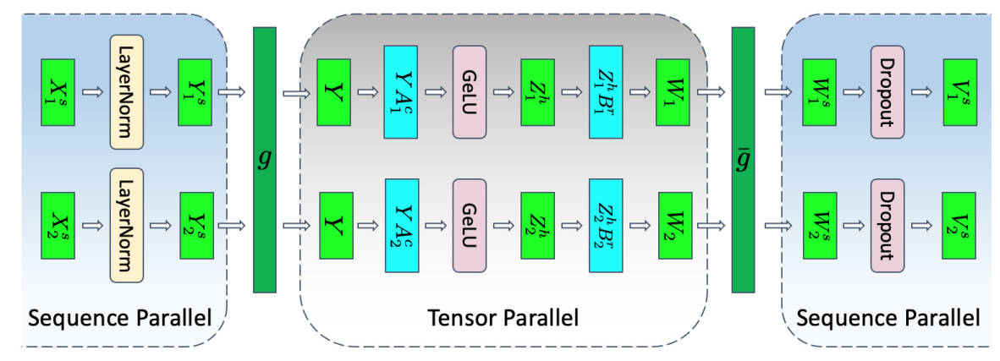

图中蓝色区域是序列并行区域，灰色区域是张量并行区域：

```text
序列并行区域：
激活沿序列维度切分
→ 本地执行 LayerNorm、Dropout 和残差相关操作

张量并行区域：
临时恢复完整序列
→ 激活和权重沿隐藏维度进行 TP 计算
```

#### 8.3.1 从序列并行转换到张量并行

以两路 TP 的 MLP 为例。进入 LayerNorm 时：

$$X=[X_1^s,X_2^s]$$

其中 $X_i^s$ 表示 rank $i$ 持有的序列分片，形状为：

$$X_i^s\in\mathbb{R}^{(s/t)\times b\times h}$$

LayerNorm 在各 rank 上独立执行：

$$[Y_1^s,Y_2^s]=LayerNorm([X_1^s,X_2^s])$$

第一层列并行 GEMM 的每个权重分片都需要处理全部 token，因此图中的 $g$ 在前向执行 All-Gather：

$$Y=g(Y_1^s,Y_2^s)$$

All-Gather 后，每个 rank 临时得到完整序列 $Y$，再执行各自的列并行计算：

$$[Z_1^h,Z_2^h]=[GeLU(YA_1^c),GeLU(YA_2^c)]$$

这里 $Z_i^h$ 沿 MLP 隐藏维度分片。

#### 8.3.2 从张量并行转换回序列并行

第二层采用行并行，每个 rank 计算输出的部分和：

$$W_1=Z_1^hB_1^r,\qquad W_2=Z_2^hB_2^r$$

传统 TP 会对 $W_1$ 和 $W_2$ 执行 All-Reduce，使每张 GPU 都得到完整 $W$。序列并行不需要每张 GPU 都保存全部 token，因此图中的 $\bar g$ 使用 Reduce-Scatter：

$$[W_1^s,W_2^s]=\bar g(W_1,W_2)$$

该操作包含两步：

1. **Reduce**：对不同 TP rank 产生的部分和逐元素求和，得到逻辑上的完整输出 $W=W_1+W_2$；
2. **Scatter**：将 $W$ 沿序列维度切分，每个 rank 只得到 $s/t$ 个 token。

```text
完整逻辑输出 W：token 1 ... token s

GPU 0：前 s/t 个 token，每个 token 保留完整 h
GPU 1：后 s/t 个 token，每个 token 保留完整 h
```

这里 Scatter 的是**序列维度**，而不是隐藏维度。如果沿隐藏维度切分，后续 LayerNorm 计算每个 token 的均值和方差时还需要额外通信。

得到序列分片后，每张 GPU 独立执行 Dropout：

$$[V_1^s,V_2^s]=[Dropout(W_1^s),Dropout(W_2^s)]$$

#### 8.3.3 前向和反向通信

$g$ 与 $\bar g$ 在前向和反向中互为共轭操作：

| 操作 | 前向传播 | 反向传播 |
|---|---|---|
| $g$ | 沿序列维度 All-Gather | Reduce-Scatter |
| $\bar g$ | Reduce-Scatter | 沿序列维度 All-Gather |

序列并行不表示完整激活从未出现。第一层 GEMM 前仍会通过 All-Gather 临时物化完整 $Y$：

```text
长期保存：每个 rank 只保存 Yi^s
计算之前：All-Gather 临时恢复完整 Y
计算之后：释放临时完整 Y
```

所以，SP 优化的是需要跨越前向和反向而长期保存的激活，而不是保证任意时刻都没有完整激活。

反向计算权重梯度：

$$\nabla A_i=Y^\mathsf{T}\nabla Z_i$$

仍然需要完整输入 $Y$。由于前向没有长期保存完整 $Y$，反向时需要再次 All-Gather；实现中通常将这次通信与其他梯度计算重叠。

### 8.4 序列并行的显存与通信

SP 将传统 TP 中未分片的 $10sbh$ 激活也沿序列维度切分。使用 TP+SP 后，每层激活显存变为：

$$M_{\mathrm{TP+SP}}=\frac{sbh}{t}\left(34+\frac{5as}{h}\right)$$

它正好等于无模型并行时每层激活显存的 $1/t$：

$$M_{\mathrm{TP+SP}}=\frac{M_{\mathrm{layer}}}{t}$$


### 8.5 激活检查点与完整重计算

即使使用 TP+SP，大模型的激活显存仍可能过高。激活检查点的基本方法是：前向只保存部分边界激活，反向时从最近检查点重新执行一遍前向。

```text
前向：
保存 checkpoint
→ 释放该层内部激活

反向：
读取 checkpoint
→ 重算该层前向
→ 恢复内部激活
→ 执行反向传播
```

如果对每个完整 Transformer 层进行检查点，只保存层输入，那么激活显存显著下降，但反向时几乎需要额外执行一次完整前向。实践中，完整激活重计算通常会增加约 30% 到 40% 的训练时间。

若每层保存一个未分片的 FP16 输入检查点，$L$ 层所需显存近似为：

$$M_{\mathrm{full\ recompute}}=2sbhL$$

它用较大的重复计算开销换取较低的激活显存。

### 8.6 选择性激活检查点

完整重计算会重算 Transformer 层内的所有操作，但不同激活的“显存收益/重算代价”并不相同。

TP+SP 下，每层激活显存为：

$$M_{\mathrm{TP+SP}}=\frac{sbh}{t}\left(34+\frac{5as}{h}\right)$$

其中，二次项：

$$\frac{5as^2b}{t}$$

主要来自注意力中的：

- $QK^\mathsf{T}$ 结果；
- Softmax 输出；
- Softmax Dropout；
- Attention over $V$ 所需的中间结果。

这些激活的体积随 $s^2$ 增长，但对应的 Softmax、Dropout 及相关操作与大型 GEMM 相比，重算成本较低。

选择性激活检查点的策略是：

> 保存重算昂贵的线性层和 GEMM 相关激活，只丢弃并重算显存占用大、计算相对便宜的注意力中间结果。

这样不需要重算完整 Transformer 层，同时可以去掉主要的 $s^2$ 激活项。$L$ 层的激活显存近似降为：

$$M_{\mathrm{selective}}=\frac{34sbhL}{t}$$

选择性重计算具有三个直接收益：

- 去掉激活显存中的 $s^2$ 项；
- 激活公式不再直接依赖注意力头数 $a$；
- 显存随序列长度 $s$ 近似线性增长。

因此，序列并行先消除 TP 之外的复制激活，选择性激活检查点再针对长序列下最昂贵的 $s^2$ 激活进行重计算，两者结合可以大幅减少激活显存，同时避免完整重计算带来的高额计算开销。

## 9. Ring Attention

标准自注意力要求每个 query 与完整序列中的所有 key 计算相关性。序列长度为 $s$ 时，注意力分数矩阵大小为 $s\times s$，计算量和中间激活显存都随 $s^2$ 增长，长序列很容易超过单张 GPU 的显存容量。

Ring Attention 的核心思想是：

> 沿序列维度将 $Q$、$K$、$V$ 分布到多张 GPU，本地保留 query 分片，并让 key/value 分片沿环形拓扑依次流经所有 GPU。

这样，每张 GPU 最终仍能计算本地 query 对完整序列的注意力，但不需要同时保存完整的 $Q$、$K$、$V$。

### 9.1 序列切分

设序列长度为 $s$，使用 $N$ 张 GPU。将序列平均切分为 $N$ 个子序列：

$$Q_n,K_n,V_n\in\mathbb{R}^{(s/N)\times h}$$

GPU $n$ 只长期保存第 $n$ 个序列分片对应的 $Q_n$、$K_n$ 和 $V_n$，但其目标是计算：

$$O_n=Attention(Q_n,K,V)$$

其中：

$$K=[K_1,K_2,\ldots,K_N],\qquad V=[V_1,V_2,\ldots,V_N]$$

也就是说，$Q_n$ 只包含本地 token，但仍必须看到所有 GPU 上的 key 和 value。

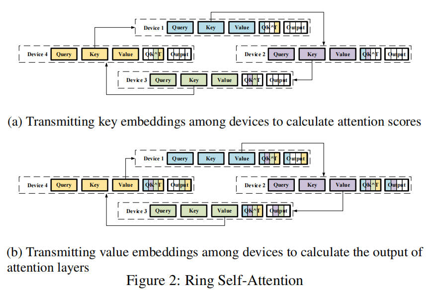

图中的设备组成一个环：

```text
Device 1 → Device 2 → Device 3 → Device 4 → Device 1
```

每轮通信中，每张 GPU 把当前持有的数据块发送给下一张 GPU，同时从上一张 GPU 接收新的数据块。经过 $N-1$ 轮后，每张 GPU 都处理过所有分片。

### 9.2 第一阶段：环形传递 Key

图的上半部分展示了 key embeddings 的环形传递。GPU $n$ 始终保留自己的本地 query $Q_n$，先使用本地 key 计算：

$$S_n^n=\frac{Q_nK_n^\mathsf{T}}{\sqrt{d_k}}$$

随后，每一轮从前一个设备接收另一个 $K_i$，并计算对应的注意力分数块：

$$S_n^i=\frac{Q_nK_i^\mathsf{T}}{\sqrt{d_k}}$$

每个分数块的形状为：

$$S_n^i\in\mathbb{R}^{(s/N)\times(s/N)}$$

经过 $N$ 个本地计算步骤后，GPU $n$ 已经得到本地 query 对所有 key 分片的分数：

$$S_n=[S_n^1,S_n^2,\ldots,S_n^N]\in\mathbb{R}^{(s/N)\times s}$$

其过程可以概括为：

```text
固定本地 Qn
→ 计算 QnKnᵀ
→ 接收下一个 Ki
→ 计算 QnKiᵀ
→ 重复 N-1 轮
```

Softmax 必须在完整 key 维度上归一化：

$$P_n=Softmax(S_n)$$

不能分别对每个 $S_n^i$ 独立执行普通 Softmax 后再直接拼接，因为各分块需要共享同一个归一化分母。

原始两阶段描述可以先保存或逻辑拼接全部分数块再计算 Softmax。现代 Ring Attention 实现通常使用分块在线 Softmax，逐块维护行最大值和指数和，从而不需要物化完整的 $(s/N)\times s$ 分数矩阵。

### 9.3 第二阶段：环形传递 Value

图的下半部分展示了 value embeddings 的环形传递。将 Softmax 结果按照 key/value 分片划分为：

$$P_n=[P_n^1,P_n^2,\ldots,P_n^N]$$

本地输出为：

$$O_n=P_nV=\sum_{i=1}^{N}P_n^iV_i$$

GPU $n$ 先使用本地 $V_n$ 计算部分输出，然后让 value 分片沿环继续传递。每收到一个新的 $V_i$，就计算并累加：

$$O_n\leftarrow O_n+P_n^iV_i$$

经过 $N-1$ 轮通信后，GPU $n$ 得到完整的本地输出分片：

$$O_n\in\mathbb{R}^{(s/N)\times h}$$

最终所有 GPU 的输出按序列维度拼接，等价于标准注意力的完整输出：

$$O=[O_1,O_2,\ldots,O_N]$$

直观上：

> $Q_n$ 固定在本地，$K_i$ 和 $V_i$ 沿环移动；每张 GPU 边接收、边计算、边发送。

### 9.4 通信与显存特点

每个 GPU 上一个 $K$ 或 $V$ 分片包含：

$$D=\frac{bsh}{N}$$

个元素。两阶段前向传播需要：

- 环形传递 $K$：$N-1$ 轮；
- 环形传递 $V$：$N-1$ 轮。

因此，按单个 GPU 的数据移动量计算：

$$V_{\mathrm{forward}}=2(N-1)D=2\frac{N-1}{N}bsh$$

随着 $N$ 增大，单卡通信量趋近于 $2bsh$。虽然每张 GPU 的本地分片变小，但每个分片最终仍需要经过环中的其他设备。

Ring Attention 适合序列长度成为主要显存瓶颈的场景。它并不减少完整注意力的理论计算量，而是把序列、激活和注意力计算分布到多张 GPU，使单卡无法容纳的超长序列能够被处理。

## 10. DistBelief、参数服务器与异步 SGD

### 10.1 它要解决的时代问题

当时，深度学习模型与数据集迅速增大，但典型 GPU 显存只有数 GB。若模型放不进单机内存或显存，单纯复制完整模型的数据并行无法运行；若完全采用同步训练，又会被异构 CPU 集群中最慢的机器拖住。

因此 DistBelief 同时追求：

1. **容量扩展**：把一个网络的节点、参数和计算划到多台机器；
2. **吞吐扩展**：运行多个完整模型副本，各自处理不同数据；
3. **容错与弹性**：允许机器变慢、下线或重启，而不是让所有工作都停在同步屏障上。

### 10.2 DistBelief 的两层并行
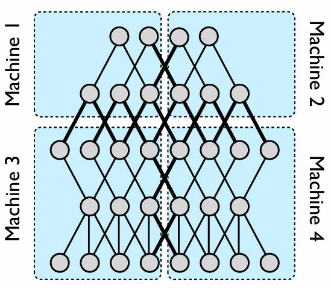

DistBelief 的一个模型副本本身就可以跨多机运行。用户描述每层节点的计算和前向/反向消息；框架将同一台机器内的节点计算用多线程分配给 CPU 核，并管理机器间通信。

```text
第一层：模型并行（一个 replica 内）
大网络的不同节点/参数分区 → 不同机器
                                   ↓
第二层：数据并行（多个 replica 间）
Replica 0 处理数据分片 D0
Replica 1 处理数据分片 D1
Replica 2 处理数据分片 D2
                 ↓
共享同一个优化目标与参数服务器
```

局部连接网络尤其适合第一层并行：绝大多数边留在分区内部，只有跨分区边的节点状态需要传输。全连接层会产生大量跨分区连接，因此通信更容易成为瓶颈。

### 10.3 参数服务器：共享参数的中心

参数服务器（Parameter Server，PS）将模型参数的权威版本集中逻辑管理，但物理上按参数切分到多个服务器分片。若有 10 个 PS shard，每个分片负责约 $1/10$ 的参数、相应梯度的接收，以及本地参数更新。

```text
Worker / model replica
  拉取所需参数分片 w
  → 在本地 mini-batch 上计算梯度 g
  → 将 g 按参数所有者推送到 PS shard
  → PS shard 立即更新其参数分片
```

这里的“中心化”是**逻辑中心**，不是所有参数都塞进一台中心机器。参数分片避免了单机内存和网络带宽成为唯一瓶颈；一个已做模型并行的 replica 中，每台机器只需访问自己负责参数对应的 PS 分片。

### 10.4 Downpour SGD：异步更新流程
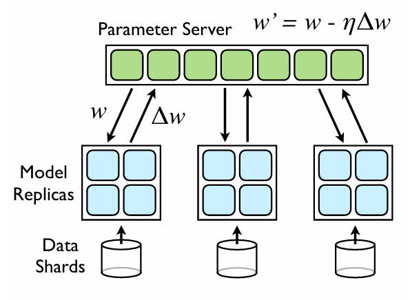
Downpour SGD 是建立在参数服务器上的异步 SGD。训练数据被分给多个 replica；每个 replica 独立执行，不等待其他 replica 完成同一批数据。最简单设定中，$n_{fetch}=n_{push}=1$：每个 mini-batch 前拉取参数，每个 mini-batch 后推送梯度。

```text
PS 当前参数 w0

Replica A：拉取 w0 → 用 batch A 计算 gA ──推送──→ PS：w ← w - ηgA
Replica B：拉取 w0 → 用 batch B 计算 gB ──推送──→ PS：w ← w - ηgB
Replica C：可能拉到 w1 → 用 batch C 计算 gC ──推送──→ PS：w ← w - ηgC
```

上例中，B 用 $w_0$ 算出的 $g_B$ 可能在 PS 已更新为 $w_1$ 后才到达。这种基于旧参数计算的梯度称为**陈旧梯度**（stale gradient）。服务器一般不回滚或等待，而是直接将它应用到当前参数上。

异步性有两层：

- 各 replica 不同步；
- 不同 PS shard 也独立处理更新。因此某一时刻不同参数分片经历的更新次数和顺序可能并不一致。

为减少通信，系统也可设置 $n_{fetch}>1$ 或 $n_{push}>1$，即连续处理多步才拉取参数或推送梯度；代价是参数和梯度通常会更陈旧。

### 10.5 异步的收益、代价与 Adagrad

Downpour 的核心交换是：**用一致性换吞吐量与容错性**。

| 特性 | 异步 Downpour SGD | 同步 SGD |
|---|---|---|
| 是否等待最慢 worker | 否 | 是 |
| 梯度对应的参数版本 | 可陈旧 | 同一训练步的一致版本 |
| 机器故障 | 其他 replica 可继续更新 | 通常需等待、重试或重组 |
| 优化噪声与调参 | 较大 | 较小、通常更稳定 |

陈旧梯度之外，PS 分片独立更新、参数拉取与梯度推送使用弱同步线程，都会增加非凸优化中的随机性。理论上这类宽松一致性较难分析；实践中，作者发现它在深度网络上依然有效。

论文采用 Adagrad 提升稳定性。对第 $i$ 个参数，累计平方梯度：

$$
G_{i,K}=\sum_{j=1}^{K}(\Delta w_{i,j})^2
$$

其有效学习率为：

$$
\eta_{i,K}=\frac{\gamma}{\sqrt{G_{i,K}}+\epsilon}
$$

梯度长期较大或被频繁异步更新的参数，$G_{i,K}$ 增长更快，步长会自动变小；更新较少或梯度较小的参数则保留相对更大的步长。这能缓和多个 replica 对“剧烈参数”的相互干扰。作者还使用 warm start：先用单个 replica 训练一段时间，再开启大量异步 replica。

