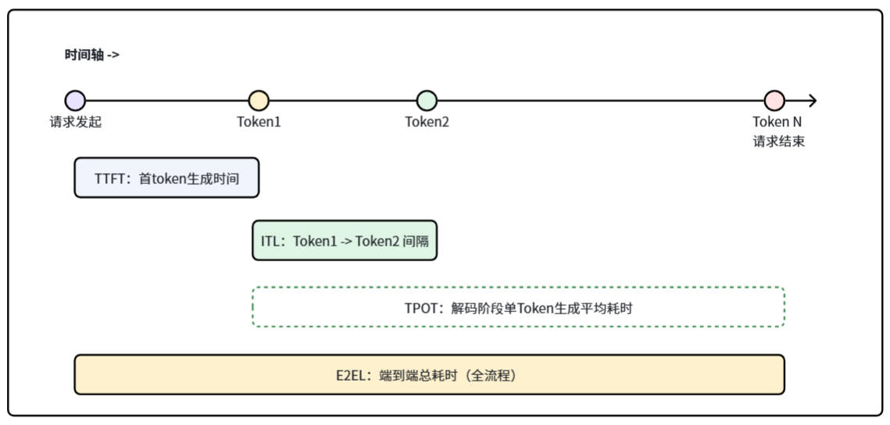
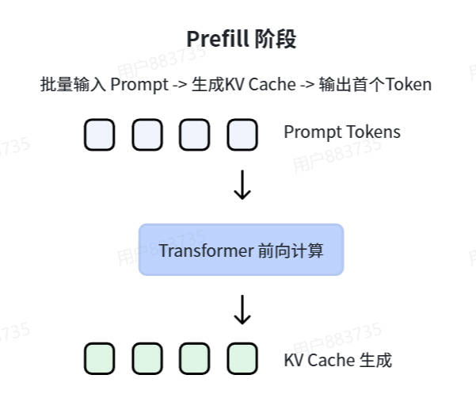
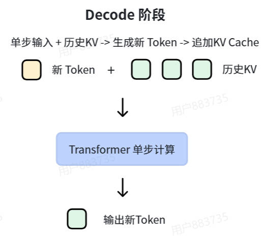
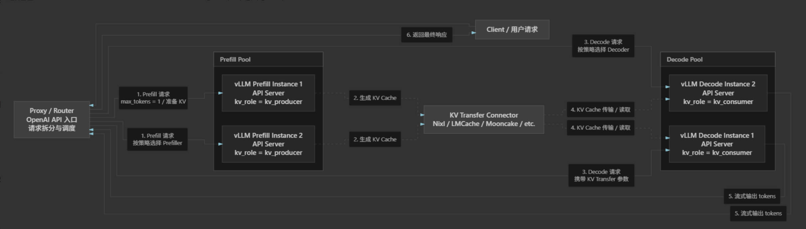
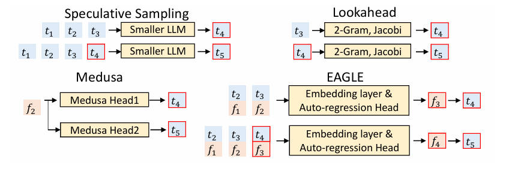
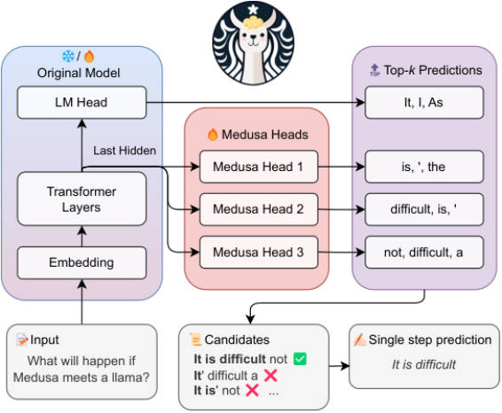
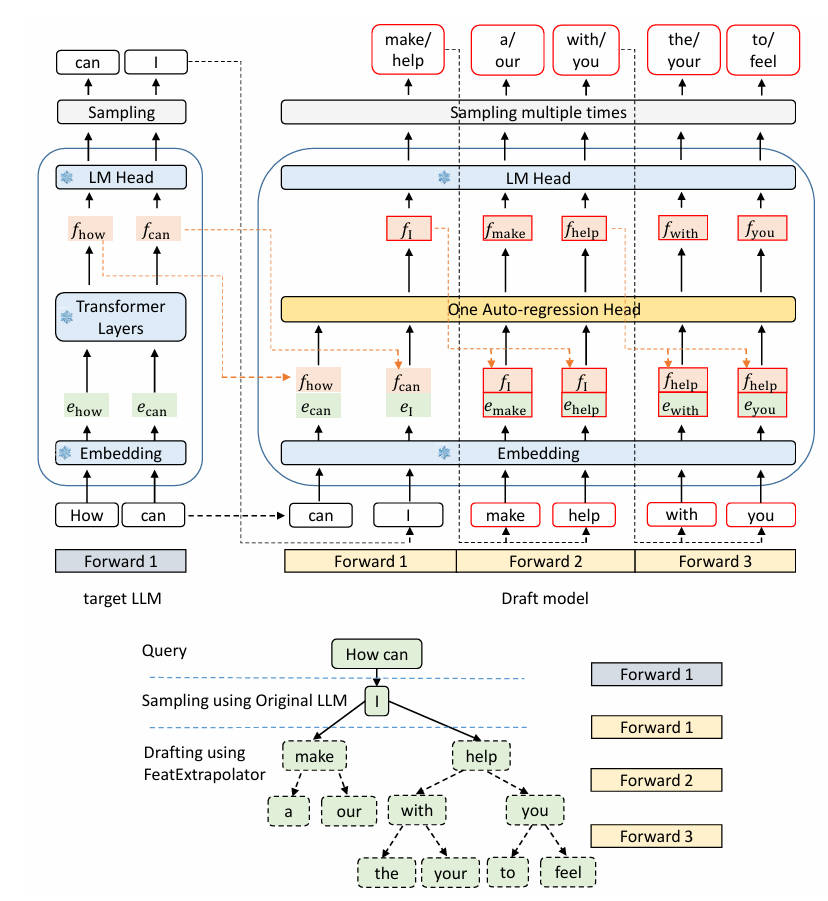
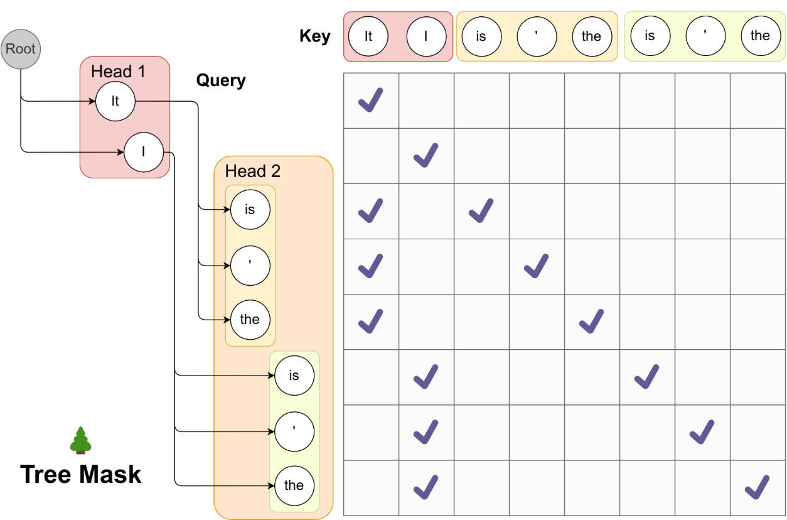

<a id="performance-metrics"></a>

# 大模型推理性能指标

## 目录

- [性能指标](#performance-metrics)
  - [指标总览](#metrics-overview)
  - [TTFT：首 Token 生成时间](#ttft)
  - [ITL：Token 间延迟](#itl)
  - [TPOT：每输出 Token 平均耗时](#tpot)
  - [E2EL：端到端总耗时](#e2el)
  - [指标之间的关系与使用建议](#metrics-guidance)
- [Prefill、Decode 与 PD 分离](#prefill-decode-pd)
  - [Prefill：处理完整 Prompt，建立历史状态](#prefill)
  - [Decode：逐 Token 生成，并追加 KV Cache](#decode)
  - [Prefill 与 Decode 的本质差异](#prefill-decode-difference)
  - [什么是 PD 分离](#pd-disaggregation)
  - [为什么要做 PD 分离](#why-pd)
  - [PD 分离的代价与适用边界](#pd-tradeoffs)
- [PagedAttention 与 vLLM 的 KV Cache 管理](#pagedattention-vllm)
  - [为什么推理需要 KV Cache](#kv-cache)
  - [传统 KV Cache 管理为什么不够好](#traditional-kv-cache)
  - [PagedAttention：把 KV Cache 像虚拟内存一样分页](#pagedattention)
  - [vLLM 的共享前缀缓存](#prefix-caching)
  - [连续批处理](#continuous-batching)
  - [Block 大小如何选择](#block-size)
  - [分块预填充](#chunked-prefill)
- [投机解码：草稿模型、N-gram、Medusa 与 EAGLE](#speculative-decoding)
  - [共同目标与验证机制](#speculative-overview)
  - [小模型草稿投机解码](#small-draft)
  - [N-gram 查找投机（Lookahead）](#ngram-lookahead)
  - [Medusa：多头并行 Token 预测](#medusa)
  - [EAGLE：特征级自回归草稿](#eagle)
  - [Tree Attention：一次验证候选树](#tree-attention)
  - [四种方式对比与选型](#speculative-comparison)



大模型在线生成通常分为两个阶段：**预填充（Prefill）**处理完整输入 Prompt，**解码（Decode）**逐个生成输出 Token。性能指标既衡量用户何时看到结果，也衡量生成过程是否流畅，以及整个请求占用系统资源的时间。

<a id="metrics-overview"></a>

## 指标总览

| 指标 | 含义 | 用户感知 | 主要对应阶段 |
| --- | --- | --- | --- |
| TTFT（Time To First Token） | 从请求发起到返回第一个 Token 的时间 | 首次响应是否及时 | 排队 + Prefill + 首次 Decode |
| ITL（Inter-Token Latency） | 相邻两个输出 Token 到达的时间间隔 | 流式输出是否卡顿 | Decode |
| TPOT（Time Per Output Token） | 解码阶段每个输出 Token 的平均生成耗时 | 稳态生成速度 | Decode |
| E2EL（End-to-End Latency） | 从请求发起到请求完成的总耗时 | 整次请求完成得快不快 | 全流程 |

<a id="ttft"></a>

## 1. TTFT：首 Token 生成时间

TTFT 的起点是客户端发起请求，终点是客户端收到第一个输出 Token。它决定了用户在提交问题后需要等待多久才看到模型开始回答。

可粗略拆为：

`TTFT = 排队时间 + 请求处理时间 + Prefill 时间 + 首个 Token 解码时间 + 网络传输时间`

其中 Prefill 会遍历输入序列并建立 KV Cache，因此 TTFT 通常随输入 Prompt 长度增加而增大。长上下文、较大的批处理、请求排队以及频繁的 KV Cache 换入换出，都会拉高 TTFT。

优化重点：降低排队与调度开销；使用连续批处理（continuous batching）；提高 Prefill 阶段的矩阵计算效率；采用 Prefix Cache/Prompt Cache 复用公共前缀；优化长上下文的注意力计算和 KV Cache 管理。

<a id="itl"></a>

## 2. ITL：Token 间延迟

ITL 是相邻输出 Token 的间隔，例如图中的 `Token1 → Token2`。在流式输出场景中，它比总耗时更直接反映“文字是否一顿一顿地出现”。

单个间隔可表示为：

`ITL_i = t(Token_{i+1}) - t(Token_i)`

理想情况下，ITL 应稳定且尽可能小。实际服务中它会受动态批处理、其他请求插入、KV Cache 访存、采样处理和网络抖动影响。因此除平均值外，常同时观察 P50、P95、P99，以避免平均值掩盖偶发卡顿。

优化重点：提升 Decode 吞吐与单步延迟；降低 KV Cache 的显存访问成本；合理控制批大小和并发度；使用分页式 KV Cache、量化或高效注意力内核；减少调度和通信抖动。

<a id="tpot"></a>

## 3. TPOT：每输出 Token 平均耗时

TPOT 是 Decode 阶段生成每个输出 Token 的平均耗时，衡量模型进入稳定生成后的速度。若共输出 `N` 个 Token，且第一个 Token 已在 TTFT 中计入，则常用近似为：

`TPOT ≈ (E2EL - TTFT) / (N - 1)`

在统计口径不同的系统中，也可能用整个解码耗时除以输出 Token 数；比较数据时应明确是否包含首 Token。TPOT 的倒数可近似理解为单请求的生成速率：

`生成速率（token/s）≈ 1 / TPOT`

TPOT 与 ITL 相关但不完全相同：ITL 是逐个 Token 的实际间隔，反映抖动；TPOT 是多个 Token 的平均耗时，反映稳定阶段的总体效率。

<a id="e2el"></a>

## 4. E2EL：端到端总耗时

E2EL 从请求发起开始，到最后一个 Token 返回、请求结束为止，覆盖排队、Prefill、Decode 和网络传输等完整链路。

若忽略网络差异并以 `N` 表示输出 Token 数，可近似写为：

`E2EL ≈ TTFT + (N - 1) × TPOT`

因此，短回答往往更受 TTFT 影响；长回答则更受 TPOT 影响。仅降低 TTFT 不一定能让长文本更快完成，仅提高 Decode 速度也不一定能改善首次响应体验。

<a id="metrics-guidance"></a>

## 指标之间的关系与使用建议

- 关注交互式聊天体验：优先看 TTFT、ITL 的 P95/P99；用户最在意“能否尽快开始回答”和“输出是否连贯”。
- 关注长文本生成：重点看 TPOT 与 E2EL；它们决定整体完成时间和稳定生成速度。
- 关注服务容量：除上述延迟外，还应结合吞吐量（output token/s）、并发请求数、排队时间、显存/KV Cache 利用率共同评估。
- 对比不同推理引擎或优化方案时：固定模型、硬件、输入/输出长度、并发度、采样参数及统计分位数；否则指标没有可比性。

> 一句话总结：TTFT 看“多久开始回答”，ITL 看“输出是否顺滑”，TPOT 看“每个 Token 生成多快”，E2EL 看“整次请求多久完成”。

---

<a id="prefill-decode-pd"></a>

# 大模型推理的 Prefill、Decode 与 PD 分离

<a id="prefill"></a>

## 1. Prefill：处理完整 Prompt，建立历史状态



Prefill（预填充）是请求进入模型后的第一个阶段。模型把完整的 Prompt Token 一次送入 Transformer 前向计算，计算各层的 Key、Value 并写入 KV Cache；随后即可采样出第一个输出 Token。图中“批量输入 Prompt → Transformer 前向计算 → KV Cache 生成”描述的正是这一过程。

Prefill 的工作量主要随输入长度增长，直接影响 TTFT。由于同一请求中的多个 Prompt Token 可并行参与矩阵乘，计算的算术强度较高，通常更接近**计算受限（compute-bound）**：提高 GPU 的矩阵计算利用率、合并多个 Prompt 以及复用共享前缀，往往能带来明显收益。

<a id="decode"></a>

## 2. Decode：逐 Token 生成，并追加 KV Cache



Decode（解码）从首个输出 Token 开始，以自回归方式循环执行：将上一个 Token 作为新输入，读取全部历史 KV Cache，完成一次 Transformer 单步前向计算，采样出一个新 Token，并把新 Token 的 K、V 追加到缓存中。重复直到遇到停止条件或达到最大输出长度。

每次 Decode 通常只处理一个新 Token，矩阵规模较小，却要读取模型权重及随上下文增长的历史 KV Cache；单请求或较小批次下，它通常更接近**访存受限（memory-bound）**。它决定 TPOT 和 ITL：任一次调度被阻塞，用户就会感到流式输出停顿。

<a id="prefill-decode-difference"></a>

## 3. Prefill 与 Decode 的本质差异

| 维度 | Prefill | Decode |
| --- | --- | --- |
| 输入方式 | 一次处理整段 Prompt | 每次处理 1 个新 Token |
| 主要产物 | Prompt 的 KV Cache，通常连同首个输出 Token | 新 Token，并持续增长 KV Cache |
| 主要性能指标 | TTFT | ITL、TPOT |
| 典型硬件瓶颈 | 更偏计算受限，适合较大矩阵并行 | 更偏访存受限，需频繁读取权重与历史 KV |
| 资源偏好 | 较大 Token 批量、较强计算能力 | 稳定的迭代调度、带宽与低时延 |
| 干扰方式 | 长 Prompt 会占用大量单轮计算预算 | 被长 Prefill 挤占时，输出间隔会变大 |

两阶段的矛盾在于：让长 Prompt 尽快完成 Prefill 有利于 TTFT，却可能抢占 Decode 的资源并损害 ITL；始终优先 Decode 则会让新请求迟迟无法开始。连续批处理和分块预填充是在同一组 GPU 上缓解这个矛盾，PD 分离则进一步从部署架构上把两类负载拆开。

<a id="pd-disaggregation"></a>

## 4. 什么是 PD 分离（Prefill-Decode Disaggregation）



PD 分离是将 Prefill 与 Decode 部署到不同实例池或不同 GPU 节点的推理架构。路由器先将请求调度到 Prefill Pool；Prefill 实例生成该请求的 KV Cache（有些实现会以 `max_tokens=1` 同时产生首个 Token）；然后借助 KV Transfer Connector 将 KV Cache 传给 Decode Pool，Decode 实例接管后续逐 Token 生成并向客户端流式返回结果。

图中的 `kv_producer` 表示生成 KV Cache 的 Prefill 实例，`kv_consumer` 表示读取 KV Cache 的 Decode 实例；NIXL、LMCache、Mooncake 等属于可用于跨实例传输或管理 KV Cache 的组件。实现不必限定于图中的具体组件，关键是：**计算 Prefill 与消费其 KV Cache 的 Decode 不再必须发生在同一实例。**

<a id="why-pd"></a>

## 5. 为什么要做 PD 分离

- **隔离两类延迟目标**：长 Prompt 不再与正在 Decode 的请求直接争抢同一调度轮次，有利于稳定 ITL；Prefill 池也可专门优化 TTFT。
- **按负载分别弹性扩缩容**：输入很长但输出很短的业务偏向 Prefill 容量；长文本生成业务偏向 Decode 容量。两个池可按各自瓶颈和请求比例独立配置 GPU 数量。
- **针对性选择硬件与批策略**：Prefill 池可偏向高计算吞吐和较大批量；Decode 池可偏向高显存带宽、低时延与稳定的连续批处理。
- **提升尾延迟的可预测性**：将 prefill 的“突发大计算”与 decode 的“高频小步迭代”隔离后，调度器更容易分别控制 TTFT 和 ITL 的 P95/P99。

<a id="pd-tradeoffs"></a>

## 6. PD 分离的代价与适用边界

PD 分离并非免费加速，它把同机内存访问变成了跨实例的 KV Cache 交接：

- **KV 传输开销**：KV Cache 的大小与层数、上下文长度成正比。跨节点复制会增加网络带宽占用和传输时延；网络较慢时，传输时间可能抵消拆分收益。
- **更高的短暂显存占用**：交接期间，Prefill 端和 Decode 端可能同时持有同一请求的 KV Cache，或需要额外的传输缓冲区。
- **系统复杂度上升**：需要路由、两套队列、KV 元数据与生命周期管理、传输失败重试、实例故障恢复和跨池背压控制。
- **调度与负载均衡更难**：Prefill/Decode 池比例固定时，任一侧可能空闲而另一侧拥塞；KV 传输未完成的请求也会形成新的排队点。
- **小请求未必划算**：短 Prompt 或低并发下，单机混合批处理已经足够高效，额外网络跳转反而会增加 TTFT 与 E2EL。

因此，PD 分离更适合长上下文、高并发、Prefill 与 Decode 资源需求明显不同，且拥有高速互连（例如高带宽 RDMA 网络）的集群。部署时应同时观测 Prefill 排队时间、KV 传输延迟/带宽、Decode ITL、两池 GPU 利用率与 E2EL，避免只优化某一个阶段而把瓶颈转移到网络或另一实例池。

> 一句话总结：Prefill 是“批量算 Prompt、写入 KV”，Decode 是“逐 Token 读历史 KV、持续生成”；PD 分离通过专用资源池隔离二者的竞争，但以 KV 传输、暂存显存和更复杂的调度运维为代价。

<a id="pagedattention-vllm"></a>

# PagedAttention 与 vLLM 的 KV Cache 管理

<a id="kv-cache"></a>

## 1. 为什么推理需要 KV Cache

自回归模型在生成第 `t` 个 Token 时，注意力计算需要让当前 Query 与此前 `1...t-1` 的所有 Key、Value 交互。若每一步都重新计算历史 Token 的 Key 和 Value，已生成部分会被重复计算，生成越长，重复工作越多。

KV Cache 会在 Token 首次经过 Transformer 各层时，把该 Token 在每层注意力中的 **Key（K）** 和 **Value（V）** 保存在显存中。后续 Decode 时只计算新 Token 的 Q、K、V，并让新 Q 读取缓存中全部历史 K、V。这样以更多显存换取更少的重复计算，是大模型推理的基础优化。

对于单个请求，KV Cache 的显存量可近似估算为：

`KV Cache 字节数 ≈ 2 × 层数 × 序列长度 × KV 头数 × 每头维度 × 每元素字节数`

其中 `2` 分别对应 K 和 V。GQA/MQA 通过减少 KV 头数，能够显著降低这一部分显存；FP8/INT8 KV Cache 量化也可进一步降低容量压力。

KV Cache 覆盖两个阶段：Prefill 一次性写入 Prompt 的 K、V；Decode 每生成一个 Token，追加该 Token 的 K、V。因此，长上下文和多并发请求会迅速把 KV Cache 推成推理服务的主要显存消费者。

<a id="traditional-kv-cache"></a>

## 2. 传统 KV Cache 管理为什么不够好

传统实现通常为每个请求预留一段**连续**显存，并按可能达到的最大长度分配 KV Cache。这种做法简单，却与在线服务中“请求长度未知、请求随时进入和结束”的特征不匹配。

- **内部碎片**：请求实际只生成较短文本，但已为其预留的最大长度空间不能被其他请求使用。
- **外部碎片**：不同长度请求不断申请、释放连续显存后，空闲块被切得零散；虽然总空闲容量足够，也可能找不到一段足够大的连续空间。
- **峰值预留限制并发**：为了避免运行中扩容，系统常按最大上下文或最大生成长度预分配，导致同一张卡可同时承载的请求数被低估。
- **共享前缀会重复存储**：例如大量请求都以相同系统提示词或文档开头，传统方案会为每个请求各存一份相同 K、V。
- **扩容和搬移代价高**：若按需扩容连续缓冲区，可能需要新分配、复制历史缓存并释放旧空间；这会增加延迟并使调度复杂化。

这些问题本质上不是注意力公式本身的问题，而是把长度可变的 KV 序列当成一段必须连续的物理内存来管理的问题。

<a id="pagedattention"></a>

## 3. PagedAttention：把 KV Cache 像虚拟内存一样分页

PagedAttention 是 vLLM 提出的 KV Cache 管理与注意力访问方式。它借鉴操作系统的分页思想：把每层 KV Cache 切成固定 Token 数的 **Block（块）**。请求的逻辑 Token 序列仍然连续，但其逻辑块可以映射到任意位置的物理块，不要求物理地址连续。

```text
请求 A 的逻辑序列：  [Token 0 ... 15] [16 ... 31] [32 ... 47]
逻辑 Block：                 0              1              2
物理 Block 映射：            7             103             28
```

每个请求维护一张 **Block Table（块表）**，记录“第几个逻辑块 → 哪个物理块”。Attention kernel 根据块表间接读取历史 K、V，计算结果与连续存储等价；区别仅在于底层内存布局。

请求开始时只分配容纳现有 Token 的块；生成到一个新块边界时再申请一个空闲物理块。请求结束后，这些块会回收到全局块池，马上可被其他请求复用。由此，预留空间从“按最大长度的一大段”变成“按实际长度的一组小块”。

PagedAttention 带来的收益包括：显著减少内部碎片；消除对大段连续显存的依赖，从而缓解外部碎片；按需增长，提升同显存下的并发度；并为不同请求共享物理块提供自然的基础。代价是需要维护块表，且 Attention kernel 要支持非连续块访问。

> 注意：PagedAttention 中的“页”是推理引擎管理的逻辑块，不等同于 CUDA 或操作系统的内存页；它的单位通常是若干个 Token 的 K、V 数据。

<a id="prefix-caching"></a>

## 4. vLLM 的共享前缀缓存（Automatic Prefix Caching）

在 PagedAttention 的块化管理上，vLLM 可以进行自动前缀缓存（APC）。当新请求的 Token 前缀与已缓存请求完全相同，系统无需再次执行这段前缀的 Prefill，而是直接复用对应的物理 KV Block，并从第一个未命中的位置继续计算。

```text
请求 A： [系统提示词 + 示例] [用户问题 A]
请求 B： [系统提示词 + 示例] [用户问题 B]
                    └── 共享已计算好的前缀 KV Block ──┘
```

vLLM 通常以**完整 Block**为粒度识别和复用前缀：一个块的哈希由父块哈希、该块 Token 内容，以及可能影响 KV 结果的附加信息（例如 LoRA 适配器、多模态输入哈希）共同确定。这样既可快速定位共同前缀，也能避免把语义不同的缓存错误复用。末尾未填满的块一般不能作为可复用的完整前缀块。

共享块通过引用计数管理。多个请求可只读共享同一前缀块；当某个请求要在共享的末尾块继续写入时，引擎会采用 copy-on-write（写时复制），先获得私有块再写入，避免修改其他请求看到的内容。缓存会受显存块池容量约束，未被引用且较久未使用的块可被逐出。

前缀缓存对固定系统提示词、RAG 共享文档前缀、多轮会话复用历史、few-shot 示例尤为有效，主要改善 Prefill 成本与 TTFT；它不会减少不同后缀的 Decode 工作，也不能命中经过分词后不同的前缀。

<a id="continuous-batching"></a>

## 5. 连续批处理（Continuous Batching）

静态批处理要等一批请求全部完成，才能换下一批。由于输出长度不同，短请求完成后留下的计算槽位会闲置，长请求则拖住整批，GPU 利用率和尾延迟都较差。

连续批处理在每一个调度迭代（iteration）重新组织批次：已在 Decode 的请求各生成一个 Token；已完成请求立即退出；新到达、且资源允许的请求立即进入 Prefill 或分块 Prefill。批次成员会持续变化，而不是固定到所有请求结束。

```text
迭代 1：A、B、C 解码
迭代 2：A 完成退出；B、C 解码；D 进入 Prefill
迭代 3：B、C、D 解码；E 可继续准入
```

PagedAttention 使这种动态加入与退出更可行：请求只需从全局池取得或归还少量 Block，无须为每次批次重排大块连续 KV Cache。调度器通常还会受 `max_num_batched_tokens`、可用 KV Block 数量、模型最大长度等约束，以在吞吐、TTFT 和 ITL 之间取得平衡。若 Prefill 请求很长，可用 **chunked prefill（分块预填充）** 按 Token 预算切分，避免一次长 Prompt 独占一个调度轮次并让 Decode 请求的 ITL 恶化。

<a id="block-size"></a>

## 6. Block 大小如何选择

Block size 指每个 KV Block 容纳的 Token 数，记为 `B`。长度为 `L` 的序列需要 `ceil(L / B)` 个块，最后一块最多浪费 `B - 1` 个 Token 位置。

| 较小的 Block size | 较大的 Block size |
| --- | --- |
| 尾块浪费少，内部碎片更低 | 块表更短，元数据和查表开销更低 |
| 前缀复用粒度细，命中机会更多 | kernel 循环次数少，访存组织通常更简单 |
| 块数量更多，调度、引用计数和块表开销更高 | 尾块浪费更多，前缀复用粒度较粗 |

实践中应以目标模型、上下文/输出长度分布、GPU 架构和内核实现为准，而非只追求最小碎片。vLLM 的可选 block size 还受注意力内核和平台支持限制；常见配置是 16 或 32 Token，具体应通过真实负载基准测试比较 TTFT、ITL、吞吐和 KV Cache 利用率。

<a id="chunked-prefill"></a>

## 7. 分块预填充（Chunked Prefill）

Prefill 对长 Prompt 的计算量远大于单步 Decode。若调度器将一个很长的 Prompt 在单个迭代中全部预填充，它会占用大量计算预算；同批正在流式生成的请求就必须等待，表现为 ITL 突然变大、输出卡顿。反过来，若一味优先 Decode，新请求又会长时间无法开始 Prefill，TTFT 会恶化。

分块预填充将一个长 Prompt 按 Token 数切成若干个 chunk，在多个调度迭代中依次完成。例如一个 4,096 Token 的 Prompt 可以按每次 512 Token 的预算分 8 次预填充。每完成一个 chunk，系统都会把这部分 Token 的 K、V 写入 KV Cache；最后一个 chunk 完成后，才可生成该请求的首个输出 Token。

```text
迭代 1：A、B Decode 各 1 Token；C Prefill 512 Token
迭代 2：A、B Decode 各 1 Token；C Prefill 后续 512 Token
...
迭代 8：A、B Decode 各 1 Token；C 完成 Prefill
迭代 9：A、B、C 一同 Decode
```

调度器通常以单轮可处理的 Token 总数（如 `max_num_batched_tokens`）为预算，优先保证活跃 Decode 请求的 Token，再把剩余预算分给一个或多个 Prefill chunk。chunk 的实际大小会受剩余预算、请求上下文长度、可用 KV Block 和模型最大长度约束。

分块预填充的核心收益是把长 Prompt 的计算摊平到多个迭代，使 Decode 和 Prefill 能在同一批次共存：流式请求的 ITL 更稳定，GPU 也能持续保持忙碌。其代价是长 Prompt 自身完成 Prefill 的时间可能拉长，因而 TTFT 未必最小；chunk 太小还会增加调度与 kernel 启动开销。

因此，分块预填充是一个延迟权衡：对混合了长 Prompt 与持续生成请求的在线服务，它通常用少量 TTFT 换取更好的 ITL 和整体吞吐；对只追求单个长 Prompt 最低 TTFT 的场景，则可能需要提高 Prefill 预算或减少切分。

> 一句话总结：KV Cache 避免重复计算历史；PagedAttention 用块表解决 KV Cache 的变长存储与共享；连续批处理让请求动态进出；分块预填充则把长 Prompt 的计算切开，与 Decode 请求公平地共享每轮计算预算。

---

<a id="speculative-decoding"></a>

# 投机解码：草稿模型、N-gram、Medusa 与 EAGLE



投机解码的共同目标是：让廉价模块提前提出多个候选 Token，再由目标大模型以一次（通常是带树状掩码的一次）前向计算验证，从而减少昂贵目标模型的串行 Decode 次数。上图展示了四类候选生成器的差异：传统小模型和 Lookahead 在 Token 层提出草稿；Medusa 从一个隐藏特征并行预测多个未来位置；EAGLE 则在特征层做自回归预测，并显式输入提前一位的 Token。

<a id="speculative-overview"></a>

## 1. 共同目标与验证机制

设目标模型的下一个 Token 分布为 `p`，草稿机制的提议分布为 `q`。候选 Token `x` 的标准投机采样接受概率为：

`min(1, p(x) / q(x))`

候选被接受时继续验收下一个；第一个被拒绝的候选及其后代被丢弃，并从校正分布 `norm(max(0, p - q))` 采样一个 Token。若草稿机制能提供正确的提议概率并采用该验证/校正流程，最终输出分布与直接从目标模型采样一致。

无论候选来自哪种方法，收益由两点决定：候选生成足够便宜，以及候选被目标模型接受的概率足够高。前者决定额外开销，后者决定一次目标模型前向能产出多少有效 Token。

<a id="small-draft"></a>

## 2. 小模型草稿投机解码

传统 Speculative Sampling 使用一个参数量更小、速度更快的草稿模型。例如以 7B 模型为草稿，验证 70B 目标模型。草稿模型以自回归方式连续生成 `γ` 个候选 Token；目标模型把“原始前缀 + 这 γ 个候选”一次送入前向计算，得到每个候选位置的目标概率并顺序验收。

```text
草稿模型：prefix → x1 → x2 → x3
目标模型：一次前向验证 x1、x2、x3
```

优点是理论成熟、自然支持严格的分布保持采样，且草稿模型可独立扩缩容。缺点是仍需运行完整的第二个语言模型；若草稿模型不够小，或与目标模型的 Token 分布差异较大，草稿生成成本和低接受率都会削弱加速效果。对于最小规格的目标模型，也可能难以找到既快又足够相似的同系列草稿模型。

<a id="ngram-lookahead"></a>

## 3. N-gram 查找投机（Lookahead）

N-gram 查找投机不依赖额外的小语言模型，而是从已有上下文、历史生成文本或缓存中查找与当前 Token 后缀相同的片段，并将该片段后续出现过的 Token 作为候选。Lookahead 通常结合 N-gram 查找与 Jacobi iteration（雅可比迭代）扩展多个位置的候选，如图中以 2-gram 为条件，由 `t3`、`t4` 分别查找并提出 `t4`、`t5`。

```text
历史中出现过：... A B → C D ...
当前后缀为：  ... A B
查找草稿：              C D
```

它的优势是几乎没有模型推理开销：无需训练草稿模型，也没有额外模型权重占用。它尤其适合重复模式明显的场景，例如代码补全、格式化文本、重复模板和重复短语。

它的局限也很直接：候选质量高度依赖 N-gram 命中与重复程度；在开放式对话、长距离依赖或低重复文本中，命中率和接受率可能很低。若要在随机采样下严格保持目标模型分布，仍需要能与目标分布相配套的概率验证与校正；许多 N-gram Lookahead 实现主要面向贪心解码或接受式验证，使用时需确认其具体保证。

<a id="medusa"></a>

## 4. Medusa：多头并行 Token 预测



Medusa 不引入一个完整的独立小模型，而是在**冻结的目标模型**最后隐藏状态上外挂多个轻量 Medusa Heads（通常是 MLP）。每个 Head 负责预测不同未来位置的 Token：例如 Head 1 预测 `t4`，Head 2 预测 `t5`，依此类推。每个 Head 都能给出 top-k Token，组合后形成候选树。

上图中，原始模型最后隐藏状态同时送入多个 Medusa Head；不同 Head 的 top-k 预测被组合为候选路径，目标模型再一次性验证候选树。这样，草稿部分只增加少量 MLP 计算，避免了运行完整小模型的成本。

Medusa 的关键限制是：多个 Head 主要从同一历史特征独立预测不同未来位置。例如预测 `t5` 时，Head 2 并没有真正以已选中的 `t4` 为条件完成完整自回归推理。因此预测距离越远，不确定性越大，深层候选准确率通常下降。

<a id="eagle"></a>

## 5. EAGLE：特征级自回归草稿



EAGLE 的草稿模块在目标模型的倒数第二层特征（LM Head 之前的隐藏状态）上工作。它复用目标模型的 Embedding Layer 与 LM Head，只训练一个轻量的 Autoregression Head。该 Head 以历史特征序列和**提前一个时间步的 Token 序列**为输入，预测下一个特征；预测特征经过原始 LM Head 后得到下一个 Token 分布。

```text
(历史特征 F1:i，提前一位 Token T2:i+1)
        → 预测特征 f(i+1)
        → 原始 LM Head
        → 提议下一个 Token t(i+2)
```

“提前一位的 Token”消除了特征预测的歧义：同一当前特征在采样到不同 Token 后会通向不同的下一特征；将已采样 Token 作为条件后，草稿头只需预测该确定分支的特征。与 Medusa 的独立多头不同，EAGLE 的自回归头会把新预测特征和新采样 Token 追加回输入，再继续生成后续候选，因此更能建模分支内的依赖关系。

图中展示了 EAGLE 用少量草稿前向计算扩展多分支树：第一轮得到候选 `can`、`I`，后续轮次在各分支上继续提出 `make/help`、`a/our/with/you` 等候选。它在低草稿开销与较高候选准确率之间取得平衡，但需要为每个目标模型训练一个草稿头，并在部署时维护其与目标模型版本的兼容性。

<a id="tree-attention"></a>

## 6. Tree Attention：一次验证候选树



Medusa、EAGLE 等树状投机方法不会把每条候选路径单独送入目标模型。它们将树的所有节点打包为一个批次，并使用 Tree Attention Mask 限制每个节点只能关注自己的祖先路径。

例如图中根节点可派生 Head 1 的 `It`、`I`，每个节点再派生 Head 2 的 `is`、`'`、`the`。若节点位于路径 `Root → It → is`，它只能关注根、`It` 和本分支的 `is`，不能关注兄弟分支 `I`，也不能关注 `I` 分支下的节点。这样既共享了公共前缀的计算，也保持了每条候选路径应有的因果条件概率。

Tree Attention 减少的是重复计算，而非完全没有额外成本：树节点越多，目标模型一次前向中的注意力计算、显存占用和掩码管理开销也越大。因此通常需要控制树的深度、每层 top-k 和总节点数。

<a id="speculative-comparison"></a>

## 7. 四种方式对比与选型

| 方法 | 候选从何而来 | 是否需额外训练 | 草稿主要开销 | 主要优势 | 主要限制 |
| --- | --- | --- | --- | --- | --- |
| 小模型草稿 | 独立小模型自回归生成 | 视草稿模型而定 | 运行完整草稿模型 | 原理简单；可严格做概率校正 | 草稿模型可能仍很慢；需模型/权重资源 |
| N-gram / Lookahead | 历史文本或缓存中的重复片段 | 否 | 查找、缓存与少量迭代 | 几乎无模型计算；适合重复文本 | 依赖重复模式；开放生成命中低 |
| Medusa | 同一隐藏状态上的多个预测头 | 是，训练多个轻量 Head | MLP 多头推理 | 草稿极轻；可并行提出树 | 远期 Token 缺少完整条件信息，准确率下降 |
| EAGLE | 特征级自回归头 + 原始 LM Head | 是，训练轻量 Head | 单层自回归头与树扩展 | 显式建模分支依赖；候选通常更准 | 需要特征接口、训练和版本适配 |

选型可遵循以下原则：重复模式显著且不希望训练时，优先尝试 N-gram Lookahead；已有合适小模型且希望使用标准投机采样时，使用小模型草稿；希望在冻结目标模型上以较低额外计算快速接入时，考虑 Medusa；若可训练轻量插件、追求更高候选接受率和树状草稿质量，则 EAGLE 更合适。

> 一句话总结：四种方法的差别主要在“如何便宜地提出足够准的候选”；小模型依赖第二个 LLM，N-gram 依赖历史重复，Medusa 依赖并行多头，EAGLE 依赖带 Token 条件的特征自回归；它们最终都要通过目标模型验证来保证输出质量。
